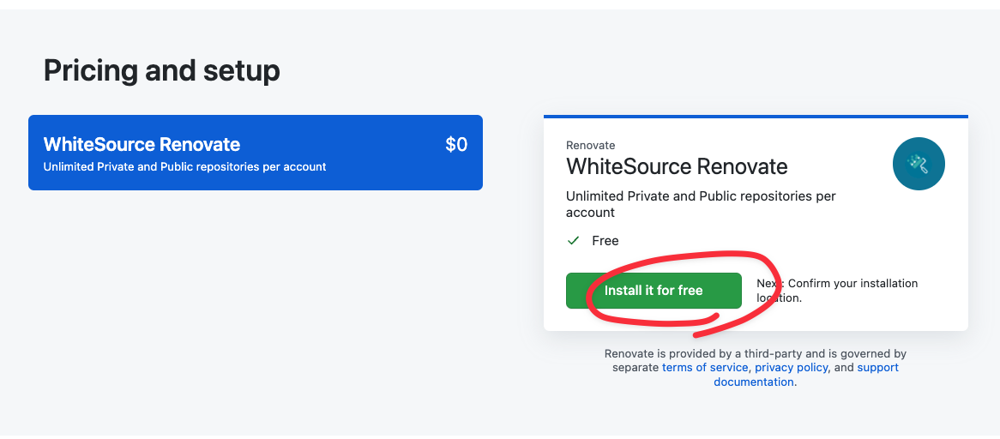
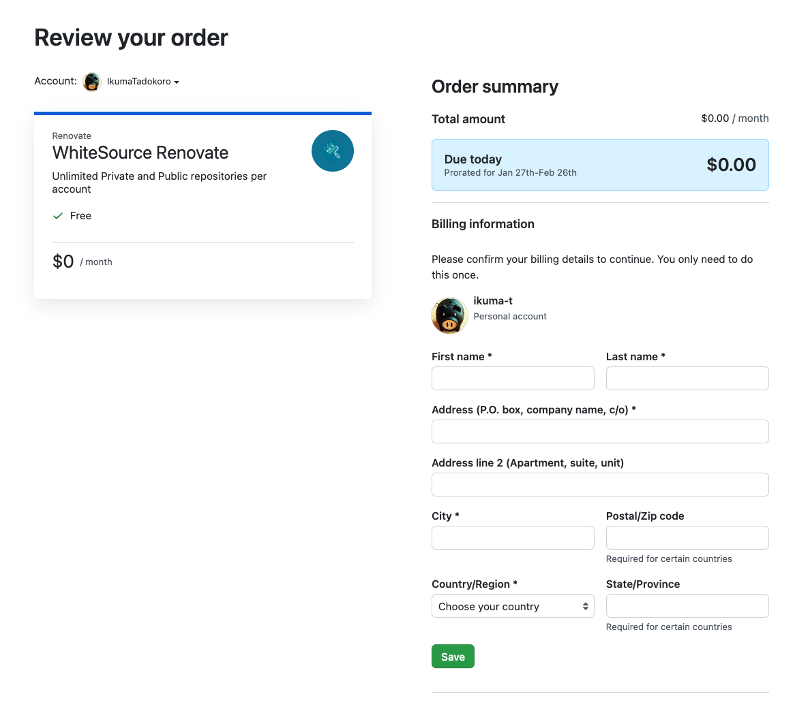
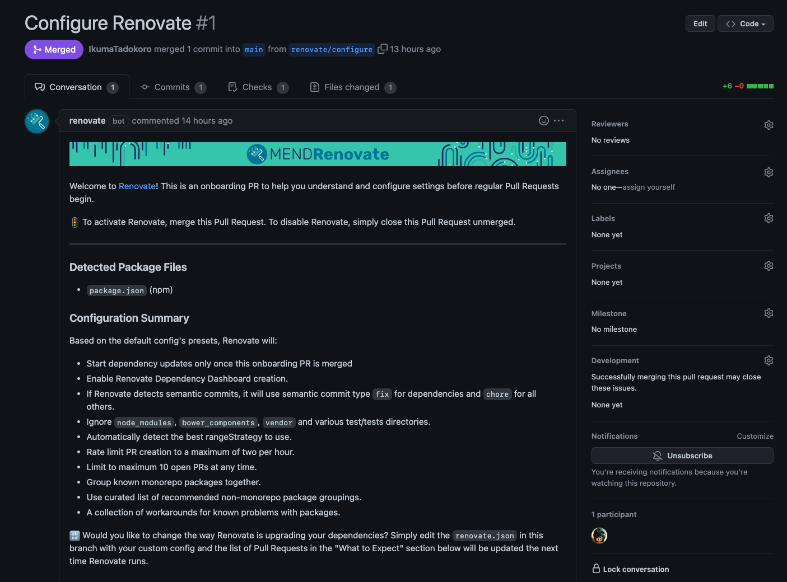
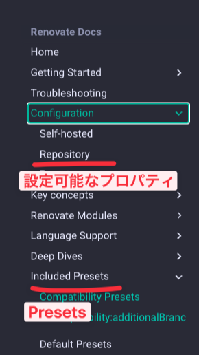

## はじめに：継続ライブラリアップデートのために...

脆弱性が検知されたり、ちょっと開発環境を改善したい、となって npm パッケージをいざバージョンアップしようと思っても、日常的にアップデートをしていないと期待するバージョンにアップするまでが茨の道デス（諦めたくなることもしばしば）。

dependabot はよく見かけるんですが、最近ではどうも Renovate がいいぞという記事をよく目にするので、今回は Renovate をこのブログのリポジトリに導入してみようと思い、色々と設定を調べてみました。

## Renovate の導入

### GitHub Apps のインストール

GitHub Apps として公開されているので、以下のリンクから Install します。

https://github.com/marketplace/renovate




必要な項目を入力して、Save。




Complete order and begin installation とかあるので、クリックして進みます。スクショ忘れましたが、このあと導入先のリポジトリの選択が求められるので、対象のリポジトリを指定します。

### Configure Renovate

Renovate をインストールしたリポジトリに対して、自動で Renovate 設定のための PR が立ち上がります。



これをマージすると、renovate.json という設定ファイルが作成され、Renovate によるライブラリアップデートが開始されます（PR が作成されるようになる）。

## renovate の設定

### デフォルトの設定

作成された renovate.json は以下のようになっています。

```json
{
  "$schema": "https://docs.renovatebot.com/renovate-schema.json",
  "extends": ["config:base"]
}
```

$schema は JSON の定義なのでさておき、extends というプロパティがあります。これは Renovate やサードパーティ・ローカルが公開したプリセットを読み込むためのものです。

- [Configuration Options \- Renovate Docs \| Renovate Docs](https://docs.renovatebot.com/configuration-options/#extends)
- [Shareable Config Presets \- Renovate Docs \| Renovate Docs](https://docs.renovatebot.com/config-presets/)
- [Full Config Presets \- Renovate Docs \| Renovate Docs](https://docs.renovatebot.com/presets-config/#configbase)

config:base は renovate が提供しているプリセットであり、具体的には以下の内容が適用されています。

```json
{
  "extends": [
    ":dependencyDashboard", // GitHub Issueとしてrenovateのダッシュボードを作成する。
    ":semanticPrefixFixDepsChoreOthers", // semantic commit messageを見つけたときに、依存関係のあるコミットにはfix、それ以外のコミットにはchoreでコミットする
    ":ignoreModulesAndTests", // node_modules, bower_components, vendorとテスト関連のフォルダ（/__tests__/**とか）を無視する
    ":autodetectRangeStrategy", // アップデート可能なバージョンの範囲に関する設定をautoにする。
    ":prHourlyLimit2", // 1時間に作成できるPRの数を2つに制限する
    ":prConcurrentLimit10", // 同時にOpen可能なPR数を10個に制限する
    "group:monorepos", // 有名なmonorepo構成のパッケージのアップデートを1つのPRにまとめる
    "group:recommended", // monorepo以外でよく使われているパッケージ群のアップデートを1つのPRにまとめる
    "workarounds:all" // アップデートでよくあるワークグラウンドを一挙に適用する
  ]
}
```

より詳細な説明は下記リンクを参照してください。

- https://docs.renovatebot.com/presets-default/#dependencydashboard
- https://docs.renovatebot.com/presets-default/#semanticprefixfixdepschoreothers
- https://docs.renovatebot.com/presets-default/#ignoremodulesandtests
- https://docs.renovatebot.com/presets-default/#autodetectrangestrategy
  - https://docs.renovatebot.com/configuration-options/#rangestrategy
- https://docs.renovatebot.com/presets-default/#prhourlylimit2
- https://docs.renovatebot.com/presets-default/#prconcurrentlimit10
- https://docs.renovatebot.com/presets-group/#groupmonorepos
- https://docs.renovatebot.com/presets-group/#grouprecommended
- https://docs.renovatebot.com/presets-workarounds/#workaroundsall

### カスタマイズの方針（公式 Docs の Key concepts を参考にする）

ベースとして適用されている設定を把握したところで、設定ファイルを自分のリポジトリに合わせて修正していきます。

#### Renovate の Key concepts

ライブラリアップデート方針はチームの状況や言語のエコシステムに依存するので一概にこうとは言えません。そのため、renovate の Docs にある Key concepts を理解し、その上でチームとして必要な設定を行うのが妥当に思えます。

Key Concepts では次の 5 つのトピックスが紹介されています。

1. Presets
2. Dependency Dashboard
3. Pull Requests
4. Renovate Scheduling
5. Automerge

Dependency Dashboard はそこまで設定に重要ではないのて、それ以外を見てみます。

#### Key concepts: Presets

[Presets \- Renovate Docs](https://docs.renovatebot.com/key-concepts/presets/)

Presets は先ほどの config:base のようなもので、よく使用されるルールをグルーピングしたものです。Presets を使うことで、

- いい感じの設定でボットを動かすことができる
- 設定の重複を避けることができる
- 他の人と設定を共有しやすくなる（これは Presets を独自に定義することができることから）
- 他の誰かの設定を利用し、その上でさらに自分用のルールを拡張しやすくなる

と記載があります。ESLint でもできるだけ個別適用は避け、既存のルールを利用するのが良いように、**設定の簡易化のために Presets を使用するのが良い**と感じました。



具体的には個別のプロパティが表示されている「Configuration > Repository」から設定が必要な値を探すのではなく、「Included Presets」の中から、自分がやりたいことをセットで提供しているルールを適用するのが良さそうです。

#### Key concepts: Pull Requests

アップデートの PR をグループしない限りは、PR のタイトルやブランチ名は一意になります。

アップデートを見送りたいためユーザーが Close した PR があった場合、次回の renovate bot の稼働時にそのブランチ名と PR タイトルから該当のライブラリのアップデートの PR を検索することで状況をチェックし、同一バージョンでのアップデートの PR を再度送らない仕様です。

ただし「アップデートの PR をグループしない限りは」ということなので、グループ化は例外です。

例えばすべてのメジャーアップデート以外をまとめるグループ化設定を付与した結果、「All non-major updates」というタイトルでアップデート PR が作成されたとします。もし一度この PR を Close してしまうと、次回以降の PR も「All non-major updates」というタイトルであるがために、renovate は PR を作成しません。

そのため、設定時にグループ化を行う際には、**そのグループにライブラリアップデートを無視する可能性がないか、グループの粒度は適切かを検討**した方が良さそうです。

#### Key concepts: Renovate Scheduling

カスタマイズの方針がそのまま書いてありました。

> 1. Tell Renovate what timezone you want to use

デフォルトでは UTC でスケジュールされているため、ローカルタイムでわかりやすくするには、**チームのタイムゾーンを設定した方が良さそう**です。

```json
{
  "timezone": "Asia/Tokyo"
}
```

> 2. Learn about the scheduling syntax

renovate のスケジューリングは以下の制約があります

- 最小単位は 1 時間。分単位のスケジュール実行や、正確な時間での粒度をサポートしていない。
- 時刻形式は[breejs/later](https://github.com/breejs/later)の形式に則る。
  - [Parsers](https://breejs.github.io/later/parsers.html#text)

例としてはここら辺が設定できるようです。

```
every weekend
before 5:00am
[after 10pm, before 5:00am]
[after 10pm every weekday, before 5am every weekday]
on friday and saturday
```

> 3. Optional: configure a "in repository schedule"

先の制約に基づいて時刻を設定します。例では毎日午前二時と一般的な影響時間外での設定が紹介されています。

```json
{
  "schedule": ["before 2am"]
}
```

```json
{
  "schedule": [
    "after 10pm every weekday",
    "before 5am every weekday",
    "every weekend"
  ]
}
```

またスケジュール自体にも Presets があるようです。

[Schedule Presets \- Renovate Docs \| Renovate Docs](https://docs.renovatebot.com/presets-schedule/)

個人的には月初日の午前 3 時以前が起動範囲の schedule:monthly なんか良さそうな気がしています。

> 4. Optional: create packageRules with a custom schedule for specific packages

スケジュールは全体に対するものだけではなく、特定のパッケージに対するスケジュールも指定できます。例では aws-sdk のような頻繁に更新されるパッケージだけ週次実行にするサンプルが掲載されています。

```ts
{
  "packageRules": [
    {
      "matchPackageNames": ["aws-sdk"],
      "schedule": ["after 9pm on sunday"]
    }
  ]
}
```

ライブラリアップデートを自動化して楽にするためのツールがノイズになってしまっては本末転倒なので、**更新頻度が予見できるもの・稼働中に気になったライブラリは、独自スケジュールを設定すると良さそうです。**

#### Key concepts: Automerge

renovate には CI がとおった PR を自動マージする機能があります。

ドキュメントでは devDependencies や自動テストがしっかりしている PJ の dependencies であれば自動マージが効果的とありますそりゃそうだ）。

設定例が上がっていたので抜粋します。

**lockFile のメンテナンスの自動化**（依存関係は崩さずに、lockFile だけ更新する）。

```json
{
  "lockFileMaintenance": {
    "enabled": true,
    "automerge": true
  }
}
```

**Linter の自動化**

```json
{
  "packageRules": [
    {
      "matchDepTypes": ["devDependencies"],
      "matchPackagePatterns": ["lint", "prettier"],
      "automerge": true
    }
  ]
}
```

**非メジャーバージョンの自動化**

```json
{
  "packageRules": [
    {
      "matchUpdateTypes": ["minor", "patch"],
      "matchCurrentVersion": "!/^0/",
      "automerge": true
    }
  ]
}
```

自動マージはやや怖いですが、**運用の中でチェックが形骸化しているライブラリについては自動マージを検討してもいいかも**です。

#### ここまでのまとめ：Key concepts に合わせた設定方針

1. 簡易化のため各設定については個別に設定するのではなく、できる限り Presets から選択する。
2. ライブラリのグループ化を検討する際は、そのグループにライブラリアップデートを無視する可能性がないか、グループの粒度は適切かを念頭に置く。
3. "timezone"でチームのタイムゾーンを指定する。
4. 更新頻度が予見できるもの・稼働中に気になったライブラリは、独自スケジュールを設定する。
5. 運用の中でチェックが形骸化しているライブラリについては自動マージを検討してもいいかも。

### カスタマイズの方針（個人的にやれた方がいいことが実現できるか確認してみる）

ここまでは公式の方針に則って汎用的な設定方針を見てきましたが、ここからは実際に個人や仕事で使いたいようなことが実現できるのかを確認していきます。

#### 生成される PR のタイトルを変更したい。リリースノートを PR タイトルで作成するので、フォーマット（タイトル頭にセマンティックコミットメッセージ）をつけたい。

Renovate はベースブランチの直近の 10 件のコミットメッセージを見て、そのリポジトリがセマンティックコミットを採用しているかどうかを判断し、セマンティックコミットがある場合にセマンティックコミットメッセージを採用するようです（おそらくこれが semanticCommits オプションの auto の挙動）。

[Semantic Commit messages \- Renovate Docs \| Renovate Docs](https://docs.renovatebot.com/semantic-commits/)

PR では Prefix を採用しているが、コミットまではルール化していない場合にはルールが適用されないので、明示的にセマンティックコミットを使うような Presets を指定します。加えて、セマンティックコミットメッセージのスコープも設定することができるので、チームに必要な形式でそれぞれ以下のように設定すると良いでしょう。

```json
// https://docs.renovatebot.com/presets-default/#semanticcommits
// 結果: chore(deps)
{
  "extends": [":semanticCommits"]
}

// https://docs.renovatebot.com/presets-default/#semanticcommittypeallarg0
// 結果: ci(deps)
{
  "extends": [":semanticCommits", ":semanticCommitTypeAll(ci)"]
}

// https://docs.renovatebot.com/presets-default/#semanticcommittypearg0
// 結果: ci(package)
{
  "extends": [":semanticCommits", ":semanticCommitTypeAll(ci)", ":semanticCommitScope(package)"]
}


// https://docs.renovatebot.com/presets-default/#semanticcommitscopedisabled
// 結果: ci
{
  "extends": [":semanticCommits", ":semanticCommitTypeAll(ci)", ":semanticCommitScopeDisabled"]
}
```

- https://docs.renovatebot.com/presets-default/#semanticcommits
- ***

なお commitMessagePrefix や prTitle という指定もあるのですが、前述の通り現状の Renovate が PR タイトルで Close 済みかどうか等を判断しているため、こちらでの設定は推奨されていないようです。

#### リポジトリ内のあるフォルダ階層より下だけを対象としたい。1 つのリポジトリにフロントエンドとバックエンドが入っていて、フロントエンドだけ Renovate を使用したい。

config:base を設定することで、node_modules, bower_components, vendor とテスト関連のフォルダ（/**tests**/\*\*とか）を無視することができますが、リポジトリにあるそれ以外のファイルはすべてアップデートの対象になります。

ignorePaths を指定することで、無視するパターンを追加することができます。

```json
{
  "ignorePaths": ["**/backend/**", "**/hoge/**"]
}
```

https://docs.renovatebot.com/configuration-options/#ignorepaths

#### npm だけを対象にしたい。

```json
{
  "extends": [":onlyNpm"]
}
```

https://docs.renovatebot.com/presets-default/#onlynpm

#### メジャー以外の@types は CI が通ったらマージしたい。

```json
{
  "packageRules": [
    {
      "packagePatterns": ["^@types/"],
      "automerge": true,
      "major": {
        "automerge": false
      }
    }
  ]
}
```

#### TypeScript はコアすぎるので、手動でやりたい。

```json
{
  "packageRules": [
    {
      "excludePackageNames": ["typescript"]
    }
  ]
}
```

https://docs.renovatebot.com/configuration-options/#excludepackagenames

#### Linter 系は 1 つの PR にまとめる

```json
{
  "extends": ["packages:linters"]
}
```

Presets である"packages:linters"が次のようになっています。

```json
{
  "extends": [
    "packages:emberTemplateLint",
    "packages:eslint",
    "packages:stylelint",
    "packages:tslint"
  ],
  "matchPackageNames": ["prettier", "remark-lint", "standard"]
}
```

さらに"packages:eslint"は以下のようになっています。

```json
{
  "matchPackageNames": ["@types/eslint", "babel-eslint"],
  "matchPackagePrefixes": ["@typescript-eslint/", "eslint"]
}
```

TypeScript プロジェクトの場合、ESLint（eslint と@typescript-eslint）と Prettier がカバーできれば良さそうなので、結果として"packages:linters"だけの指定で良さそうです。

https://docs.renovatebot.com/presets-packages/#packageslinters
https://docs.renovatebot.com/presets-packages/#packageseslint

#### 最低 N 人の Approve が必要でも、オートマージできるか？

https://github.com/apps/renovate-approve

Renovate が提供しているこの Bot を利用することで、最低 1 人の Approve が必要な場合でも自動でマージが可能になるようです。

https://github.com/apps/renovate-approve-2

最低 2 人の Approve が必要な場合は、こちらのボットも追加で導入が必要です。

#### ラベルをつける

デフォルトではラベルは適用されず、labels を指定することで適用されます。あまり差分はありませんが、1~2 個のラベルを指定できる Presets もあります。単純にラベルを付与するだけであればこちらで良いでしょう。

https://docs.renovatebot.com/presets-default/#labelarg0
https://docs.renovatebot.com/presets-default/#labelsarg0-arg1

```json
{
  "extends": [":labels(dependencies, renovate)"]
}
```

またラベルはパッケージレベルで付与することもでき、この場合は labels オプションを個別に適用します。

https://docs.renovatebot.com/configuration-options/#labels

以下のようにすることで、eslint 系のライブラリである場合は「linting」が適用されます（ラベルルールはマージされず、最後にマッチしたものが適用される）。

```json
{
  "labels": ["dependencies"],
  "packageRules": [
    {
      "matchPackagePatterns": ["eslint"],
      "labels": ["linting"]
    }
  ]
}
```

#### 調べていて「へ〜」となった、Pin

「pin の PR を自動マージ」という設定が何箇所かで出てきて、「pin is 何？」と思っていたんですがこれは npm のバージョン固定の話みたいですね。

[package\.json のチルダ\(~\) とキャレット\(^\) \- Qiita](https://qiita.com/sotarok/items/4ebd4cfedab186355867)

https://docs.renovatebot.com/dependency-pinning/

- SemVer で package を指定すると、その範囲でのアップデートが発生する。アップデートによりアプリに動作影響があった場合に、前回値と今回値の中のどれかのバージョンが原因になるが、それを 1 つずつ見ていく必要がある。
- バージョンを固定（Pin）すれば、上記問題は解決する。一方で Renovate を使用していると固定したバージョン以外はすべて PR が作成されるためノイズになる。
- この対応策として Renovate は自動マージを提案する。自動マージに向いているライブラリ/リポジトリの特性は前述の通り。また PR 自動マージでは GitHub の通知がノイズになりうる。これに対しては automergeType を branch に設定すれば、CI が失敗しない限りは PR が作成されずにマージされる。あとは必要に応じてグループ化を行うことも検討されたし。
- .lock ファイルを使用しているのに、なぜ依存関係を固定する必要があるのか？
  - lock ファイルのメリットは複数人での開発時に同じ依存関係をインストールできる点
  - yarn upgrade を一括で実行した場合にはどれが開発ソースに対して影響を及ぼすライブラリの変更なのかわからない。
  - もちろん手動で一つずつ上げる手もあるけど、固定しておけば、Renovate 側が個別に実行してくれるので「どのパッケージ」の「どのバージョンが壊れたのか」の推測可能性を保ちつつも、より少ない工数でアップデートを行うことができる。
- といいつつも Renovate 自体は"Flexible, so you don't need to be"というスタンス。

https://github.com/commitizen/cz-conventional-changelog-default-export/pull/4#issuecomment-358038966

こちらも参照とのこと。

### 最終的な renovate.json

```json
{
  "$schema": "https://docs.renovatebot.com/renovate-schema.json",
  "extends": [
    "config:base",
    ":timezone(Asia/Tokyo)",
    "schedule:monthly",
    ":label(renovate)",
    "packages:linters",
    ":onlyNpm",
    ":semanticCommits",
    ":semanticCommitTypeAll(task)",
    ":semanticCommitScopeDisabled"
  ],
  "ignorePaths": ["**/backend/**", "**/hoge/**"],
  "packageRules": [
    {
      "packagePatterns": ["^@types/"],
      "automerge": true,
      "major": {
        "automerge": false
      }
    },
    {
      "excludePackageNames": ["typescript"]
    }
  ]
}
```

まずはこのブログのリポジトリでこの設定で動かしてみて、問題があればまた追記・修正したいと思います。

## おわりに

dependabot より柔軟、されど設定項目が多いという前評判は確かに,,,という感じでした。
CLI 版を使ってローカルで起動することもできるっぽいので色々実験しつつ、仕事で使っている環境にも入れていきたい所存です。

## 参考

- [Renovate ではじめる依存関係更新の自動化 \- Tech Blog \- Recruit Engineer](https://blog.recruit.co.jp/rls/2019-12-10-renovate/)
- [はてなで使用している Renovate の設定プリセットを公開しました \- Hatena Developer Blog](https://developer.hatenastaff.com/entry/2020/06/19/113030)
- [Renovate の導入と半年間の運用の振り返り](https://zenn.dev/sunadoi/articles/889219ab865583)
- [Automate Dependency Updates With Renovate, Not With Dependabot \| JavaScript in Plain English](https://javascript.plainenglish.io/automate-dependency-updates-by-renovate-not-by-dependabot-6efddd549a3e)
- [Renovate による依存関係更新フロー改善ことはじめ \- Cybozu Inside Out \| サイボウズエンジニアのブログ](https://blog.cybozu.io/entry/2021/06/01/080000)
- [Renovate を使ってライブラリアップデートの自動マージ \- $shibayu36\->blog;](https://blog.shibayu36.org/entry/2020/11/10/183000)
- [Renovate の導入と半年間の運用の振り返り](https://zenn.dev/sunadoi/articles/889219ab865583)
