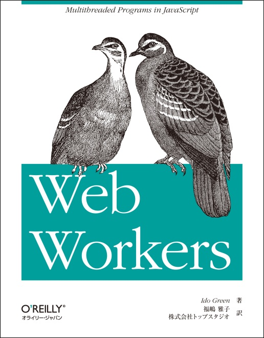

画像引用元：https://www.oreilly.co.jp/books/9784873115962/

オライリーの[Web Workers](https://www.oreilly.co.jp/books/9784873115962/)を読みました。
そろそろ Cloudflare Workers を触ろうと思っていて、そしたら Service Worker は知らんとな → そもそも Worker ってなんとなくわかるけど、ちゃんと説明できないな、ということで少し古めですが本書を読んで基本をかじってみることにしました。

## この本で学んだこと

- Web Worker は HTML5 の機能の一つで、JavaScript でマルチスレッドを実現するためのもの。メインスレッドの DOM を操作できない制約がある。
- main と worker でオブジェクトは共有されない。メッセージをやりとりすることで通信するが、オブジェクトのコピーによりパフォーマンスに影響が出る場合は、[移譲可能オブジェクト](https://developer.mozilla.org/ja/docs/Web/API/Web_Workers_API/Transferable_objects)を利用できる。
- Web Worker の種類には Dedicated Worker（専有）と Shared Worker（共有）がある。前者は 1 つのスクリプトからしかアクセスできないが、後者は複数のスクリプトからアクセスできる。

総じて「そもそも Web Worker ってなにもの？？」という超初歩的な問いに対しての答えを得ることができました。Web Worker における Hello World 的な存在が素数計算だということも初耳でした（今後サンプル作る時にやろう）。

---

読んでいる中でいくつか「これはどうなんだろう？」と疑問に思って調べたポイントをいくつかまとめます。

### Web Worker VS Promise

「メインスレッドから処理を移譲することで、コンテンツの描画をブロックしないでおくことができる」という内容を見た際に、 **これは Promise でも実現できるのでは？** と思いました。
例えばインポート処理を行うボタンを押した際に、取り込み処理自体は Promise で非同期に実施し、適当にローディングアニメーションを付けて他の箇所は操作可能にしておくという実装はそれほど難しくありません。

この質問に対しての 1 つの回答は、 **「CPU に負荷のかかる処理は、メインスレッドで順序を入れ替えても解決しないので Web Worker を使う意味はある」** です。

例として処理時間が 30 秒かかる画像のリサイズ処理を考えます。Promise で非同期に実行する場合、結局は画像のリサイズ処理を行うスレッドが 1 つしかないので、同期的に 30 秒待つことはなくとも、トータルとしては 30 秒の処理時間が必要になります。

一方で Web Worker を複数起動すれば、それらはメインスレッドとは別のスレッドとなり、その処理を並列で処理することができます。3 つの Worker をたて、1 つの Worker が捌く量を全体の 1/3 にすることで、ガバガバ計算ですが各スレッド単位での実行時間は 10 秒になります。そしてこれらは並列に処理されるので総実行時間も 10 秒です。

そのため計算処理自体が重い場合は Web Worker の使用を検討する材料の 1 つになりうるでしょう。

### Shared Worker VS BroadCastChannel

これは半分勘違いだったのですが、 **「複数のブラウジング・コンテキスト間で情報を共有できるという側面だけからこれらを見た時に、それぞれをいつ使うのか？」** と疑問に思いました。

そこであらためてそれぞれがどういう API なのか書き出してみました。

- BroadCastChannelAPI: 異なる文書やウィンドウ間でメッセージを送信するための API
- Shared Worker: 複数の文書やウィンドウから利用可能な共有のワーカースレッドを作成するための API

「複数のブラウジング・コンテキスト」をターゲットに機能していることは共通していますが、単純にメッセージを送信するのか、それとも実際に計算処理やコネクションを保持するといった具体的な処理を行うのかという点で、そもそもの目的が異なっています。

そのためこれらは競合するものではありません。例えば Shared Worker で Web Socker のコネクションを共有し、各ブラウジング・コンテキストに対しては BroadCastChannelAPI を使ってメッセージを送信するといった使い方もできるでしょう。

実際に実装していないので動くのかはわかりませんが、HTTP/1.1 における Server Sent Event のドメイン接続上限（6 つまで）を、Shared Worker を使って回避するといった使い方も可能なのではないでしょうか。

## この本で学べなかったこと

- Service Worker について
- 結局 Worker を実際のアプリケーションレベルでどう使用すべきか
  - comlink を使うとか？
- TypeScript における Worker の利用方法

## この本を読む際の注意点

この本は 2013 年に出版された本です。そのため、以下の点に注意して読む必要があります。

- 出版当時にまだ世に出ていなかった Service Worker についての解説がありません。
- 全体的にサンプルコードが古いです。具体的には、大きいところで現状と異なる仕様の Twitter からのデータ取得を行うサンプル（これは今年の頭に出しても動かなくなっていそうですが）や、https ではなく http が使われている、細かいところでは変数宣言で`var`が多用されているなど。
- ブラウザの対応状況が諸々異なっています。Can I Use などで適宜確認してください。

## 感想

やや内容は古めでしたが、内容がコンパクトだったので数時間で読め、ざっくりと Web Worker とは何者かについて知ることができました。

Web Worker がメインスレッドの DOM 操作ができないことがわかると、PartyTown が Service Worker から同期 XHR で DOM を参照している仕組みが、俄然興味深いものに感じます。

というわけで今度は MDN と web.dev あたりを読みながら Service Worker に対する理解を深めていきたいです。
