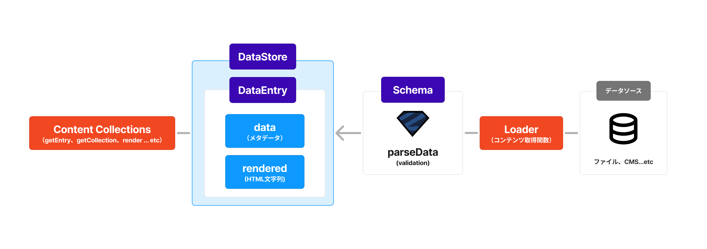

:::tip
この記事は [株式会社エス・エム・エス Advent Calendar 2024](https://qiita.com/advent-calendar/2024/bm-sms) 12月10日 分の記事です。
:::

もうそろそろ冬休みですね。「冬休みは個人ブログを作って（あるいはリニューアルして）、来年はアウトプットを頑張るぞ！」という方も多いのではないでしょうか。

Astro や Eleventy、Next.jsなど、各フレームワークによりMarkdownブログは超速で作れるようになりましたが、外部のCMSからデータを取得するとなるとやや面倒です。

[Astro v5](https://5-0-0-beta.docs.astro.build/en/guides/upgrade-to/v5/) からは [Content Layer](https://astro.build/blog/future-of-astro-content-layer/)という機能が追加され、外部のコンテンツデータを利用したサイト作成がより簡単になりました。この記事では、Content Layer が何を解決し、どのようにコンテンツサイト構築に使えるのかを紹介します。

## なぜ Content Layer を使うのか

### 個人ブログ開発はどうコンテンツを取得するかが9割

個人ブログを自作する際に必要な技術はさまざまですが、コアとなる技術はコンテンツを取得し HTML として描画できる形に変換することです。もちろん正しいマークアップや魅力的なスタイリングなども重要ですが、それらもコンテンツがあってこそ必要になるものであり、コンテンツがなければ何も始まりません。

これまでの Astro においても、この部分を簡素化するために[Content Collections](https://5-0-0-beta.docs.astro.build/en/guides/content-collections/)という機能が提供されていました。

これは zod によるメタデータ（タイトルや公開日など）のバリデーションと、ファイルシステムからのデータ取得を簡単にするための Query API を提供するもので、以下のようなスキーマ情報を定義するだけで、Markdown ファイルによるブログ記事の取得を簡単に行うことができます。

```ts title=src/content/config.ts
import { defineCollection, z } from 'astro:content';

// defineCollection を用いて、ブログのメタ情報を定義（これとは別に本文が含まれる）
const blog = defineCollection({
	schema: z.object({
		title: z.string(),
		description: z.string().optional(),
		publishDate: z.date(),
		category: z.enum(['tech', 'idea', 'life']).default('idea'),
		draft: z.boolean().default(true),
		tags: z.optional(z.array(z.string())),
	}),
});

export const collections = { blog };
```

<br />

```astro title=src/pages/blog/1.astro
---
import { getEntry, render } from 'astro:content';

const entry = await getEntry('blog', '1');
const { Content } = await render(entry);
---
{/* メタデータを表示する */}
<p>Published on: {entry.data.published.toDateString()}</p>

{/* Markdownがhtmlに変換されているので、そのまま記事を描画できる */}
<Content />
```

### Content Layer はコンテンツ取得を抽象化する

Content Collections は便利な機能ですが、ローカルの Markdown ファイルでしか利用できないという課題がありました。

そこで Content Collections をベースに、より抽象的に「コンテンツを取得する」機能を提供するのが Content Layer です。

コンテンツを取得するためのAPI（Content Collections）はそのままに、次の概念が追加されています。



1. Loader: データソースからデータをフェッチし、DataStore に格納するための関数
2. Schema: zodにより定義された、コンテンツのメタデータのスキーマ情報
3. DataStore: データソースから取得されたデータを保持するストア[^1]
4. DataEntry: DataStoreに格納される1つ1つのデータ。メタデータとして`data`、HTMLとしてレンダリングされた際に表示するコンテンツとして`rendered`を持つ。

[^1]: 記事執筆時点（2024/12/10）ではインメモリのKey-Valueストアとして実装されている

コンテンツが DataEntry として抽象化されたことによって、規定のインターフェースを満たすようにデータをフェッチして格納する関数さえ実装できれば、どのようなデータソースからでも同じようにデータを取得することができるようになりました。

また Loader はビルド時（開発時はサーバ起動時）にすべてのデータをフェッチし、zodによるスキーマバリデーションを行うため、ランタイムでのデータ取得エラーやバリデーションエラーを防ぐことができます。

### Content Layer の実例：Speakerdeck の RSS フィードから登壇ページを実装する

実例として、[このサイトの登壇ページ](/talk)は Speakerdeck の RSS と Content Layer を組み合わせて実現されています。


Content Layer がない場合、次の内容を自前で実装する必要がありました。

- Speakerdeck の RSS を fetch し、特定のデータ構造にパースする関数
- キャッシュ取得のビルドプロセスへの組み込み
- キャッシュデータからコンテンツを取得するユーティリティ関数

Content Layer を利用することで、これらの実装を省略し、Speakerdeck のデータを取得するための Loader を実装するだけで済みます。
加えて RSS フィードについては、コミュニティですでに公開されている Loader があるため、自前で実装する必要もありません。

マークアップは省略していますが、登壇ページの実装はおよそこれだけです。

```ts title=src/content/config.ts
import { defineCollection } from 'astro:content';

const talks = defineCollection({
  // コミュニティで公開されている feedLoader を利用
	loader: feedLoader({
		url: 'https://speakerdeck.com/ikumatadokoro.rss',
	}),
});

export const collections = {
  talks,
};
```

<br />

```astro title=src/pages/talk/index.astro
---
import { getCollection } from 'astro:content';

const talks = await getCollection('talks');
const talksByYear = Map.groupBy(talks, (talk) => talk.data.pubdate!.getFullYear());
---

<div>
  {talksByYear.entries().map(([year, talks]) => (
    <p>{year}</p>
    {talks.map((talk) => (<TalkCard talk={talk} />))}
  ))}
</div>
```

## Content Layer を利用する

Content Layer を利用する際には、コミュニティで公開されている Loader を利用するか、独自の Loader を実装するかの2つの方法があります。

細かい使い方や定義は [Astro の公式ドキュメント](https://5-0-0-beta.docs.astro.build/en/reference/content-loader-reference/) に譲るとして、実際にどのような形式で使えるのかを見ていきます。


### コミュニティが公開している Loader を利用する

自分が利用したいデータソースの Loader がすでにコミュニティで公開されている場合は、それを利用することで手軽にコンテンツを取得できます。

Loader は npm パッケージとして公開されており、現在公開されている Loader は [Astro公式のIntegration](https://astro.build/integrations/?search=&categories%5B%5D=loaders) ページから確認することができます。


現在コミュニティで公開されている Loader の例としては、次のようなものがあります。

- Notion
- Google Spread Sheet
- RSS Feed
- GitHub Discussions

使用方法は設定ファイルである `src/content/config.ts` に対象の `loader`を指定するだけです。

多くの Loader は取得元を特定するために追加の引数を受け付けます。たとえば先ほど例に挙げた RSS の Loader は、取得元の URL を引数として受け付けます。

```ts title=src/content/config.ts
const talks = defineCollection({
  // feedLoader は フィードの url を引数に取り、Loader を返す関数
	loader: feedLoader({
		url: 'https://speakerdeck.com/ikumatadokoro.rss',
	}),
});
```

この状態で開発サーバを起動すると、コンテンツの取得およびインメモリの KV ストアへの格納が行われ、RSS フィードから取得した内容をアプリ内で描画できるようになります。簡単ですね！

### 独自の Loader を実装する

自分が利用したいデータソースのLoaderがない場合や、必要なメタ情報のスキーマが異なる場合は、自分で Loader を実装することもできます。

Loader は`defineCollection`の中に直接記述することもできますが（[Inline loaders](https://5-0-0-beta.docs.astro.build/en/reference/content-loader-reference/#inline-loaders)）、保守性の観点から別途関数として定義することをおすすめします（[Object loaders](https://5-0-0-beta.docs.astro.build/en/reference/content-loader-reference/#object-loaders)）。

Loader関数の全体感は次のようになっており、最終的にLoaderの名前（`name`）、スキーマ（`schema`）、データ取得処理（`load`）をプロパティに持つオブジェクトを返すように実装します。

```ts title=src/content/loader/awesomeLoader.ts
import { type Loader, type LoaderContext } from 'astro/loaders';

export const awesomeLoader = (options: { yourApiOptions: string }): Loader => {
	const schema = /* メタデータのスキーマ定義 */;
	const load = /* データ取得処理 */;
	return { name: 'awesomeLoader', schema, load };
};
```

`schema`はタイトルや日付、タグなどのコンテンツのメタ情報を表すもので、zodにより定義されます。

```ts
const schema = z.object({
  title: z.string(),
  createdAt: z.date(),
});
```

`load`はデータを取得して DataStore に格納するための関数です。利用したいデータソースによって詳細な実装は変わりますが、大まかには次の3段構成で捉えると実装しやすいでしょう。

```ts
const load = async (context: LoaderContext) => {
  // 1. データを取得し、必要に応じて加工する
  const apiUrl = 'https://...';
  const data = await fetch(apiUrl);
  const json = await data.json();

  // 2. 取得したデータのバリデーションを行う
  const parsedData = await context.parseData(json);

  // 3. データをStoreに保存する
  const store = context.store;
  store.set({
    id: parsedData.id
    data: parsedData,
    rendered: {
      html: parseData.body
    }
  });
};
```

`context`からは Loader に必要な情報が提供されており、具体的には Vite の機能を利用したHMRを実現するための`watcher`や、ログを記録するための`logger`などがあります。

より詳細を知りたい方は [Astro Content Loader API | Docs](https://5-0-0-beta.docs.astro.build/en/reference/content-loader-reference/#loadercontext) を参照してください。

:::tip[コラム：Markdownコンテンツのパース]

実際にLoaderを実装しようとすると、MarkdownコンテンツをHTMLとして扱えるようにしたいケースが多いと思います。

Astro が提供する`render` APIを用いることで、DataStoreに格納された各DataEntryの`rendered`プロパティをHTMLとして描画できます。


```astro
---
import { render } from 'astro:content';

const entry = await getEntry('blog', '1');
const { Content } = await render(entry);
---

<Content />
```

しかしこの`render`関数はあくまで`string`型の`entry.rendered.html`をそのまま表示するだけで、MarkdownをHTMLに変換する機能は内包されていません。

この部分は自前で実装する必要があり、たとえば`@astrojs/markdown-remark`を利用することでMarkdownをHTMLに変換することができます。

```ts
import { AstroConfig } from 'astro';
import { DataEntry } from "astro:content";
import { createMarkdownProcessor } from "@astrojs/markdown-remark";

export const renderToString = async (config: AstroConfig, entry: DataEntry) => {
  const processor = await createMarkdownProcessor(config.markdown);
  const result = await processor.render(entry.body || '');
  return {
    html: result.code,
  }
};
```

:::


## おわりに

<iframe title="プレゼンテーション | これで最後にしたい！ Astroと立ち向かう 6度目の個人ブログ再開発" loading="lazy" class="speakerdeck-iframe" frameborder="0" src="https://speakerdeck.com/player/93a135314f704d6894c2a59e55f2f457" allowfullscreen="true" style="border: 0px; background: padding-box padding-box rgba(0, 0, 0, 0.1); margin: 0px; padding: 0px; border-radius: 6px; box-shadow: rgba(0, 0, 0, 0.2) 0px 5px 40px; width: 100%; height: auto; aspect-ratio: 560 / 315;" data-ratio="1.7777777777777777"></iframe>

2024年は人生初の北海道（生まれてからずっと千葉県民）のカンファレンス[^2]に行き、「個人ブログ、もうリニューアルしないぞ！」という発表をしてきました。

長期休みは個人ブログを作り直しがちで、ちょうど1年前のお正月にブログを作り直しています...。北の大地で交わした約束を反故にするわけにもいきませんので、今年の年末年始は自分ではない誰かのブログをリニューアルさせることを目標にこちらの記事を執筆しました。

冗談はさておき。個人ブログを開発することは、普段扱っているアプリケーションとは異なる視点での開発ができるためおすすめです。今回紹介した Content Layer を使って、より簡単にコンテンツを取得することができるようになりましたので、ぜひ今年の年末年始は個人ブログを作ってみてはいかがでしょうか。

[^2]: [Tech RAMEN Conference 2024](https://techramenconf.net/)。旭川で開催されたいろいろと異色のカンファレンス。

## 参考

- [The Astro Content Layer | Astro](https://astro.build/blog/future-of-astro-content-layer/)
- [Content collections | Docs](https://5-0-0-beta.docs.astro.build/en/guides/content-collections/)
- [コンテンツコレクション | Docs](https://docs.astro.build/ja/guides/content-collections/#%E3%82%B3%E3%83%AC%E3%82%AF%E3%82%B7%E3%83%A7%E3%83%B3%E3%81%AE%E5%AE%9A%E7%BE%A9)
- [Astro Content Loader API | Docs](https://5-0-0-beta.docs.astro.build/en/reference/content-loader-reference/)