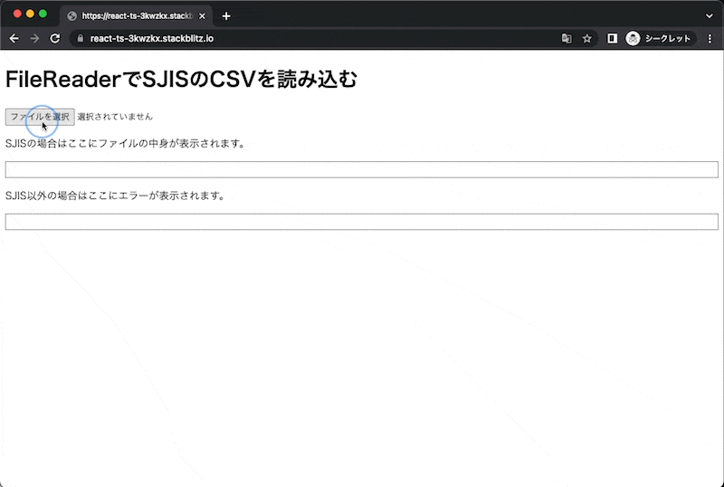
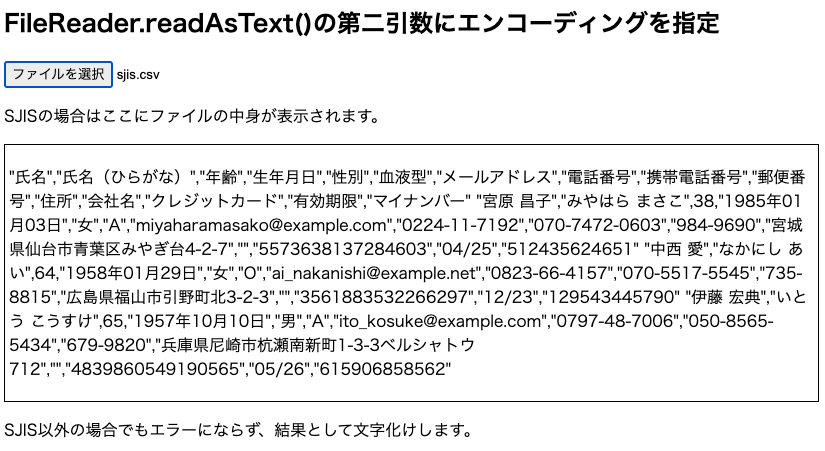
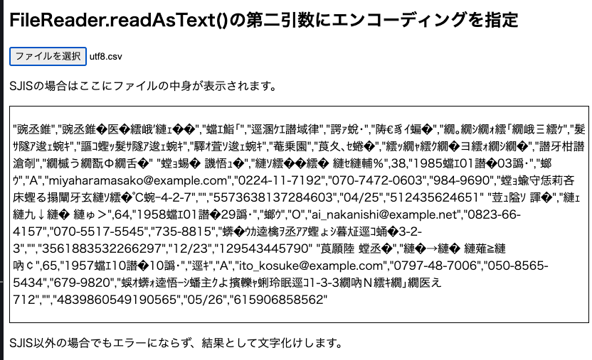

## はじめに

SJIS の文字コードで表されたテキストファイルを UTF-8 として受け取る実装について、ライブラリを使用した実装の記事が多くあります。有名どころだと iconv-lite や Encoding.js あたりでしょうか。

しかしながら、SJIS to UTF-8 くらいであればブラウザ標準の API で十分対応できたので、この記事で解説します。

## 結論

ブラウザ標準の API で SJIS で表現されたテキストファイルを UTF-8 として受け取るには以下のいずれかの方法を使用する。

1. FileReader.readAsText() の第二引数にエンコーディング情報として「sjis」を渡す（reader.readAsText(file, 'sjis')）
2. ArrayBuffer として読み込んだ内容を、TextDecoder で decode する（decoder.decode('sjis')）

## ソースコードとデモ



https://stackblitz.com/edit/react-ts-3kwzkx?file=App.tsx

## 1. FileReader にエンコーディング情報を指定して、SJIS を読み込む

### FileReader とは

https://developer.mozilla.org/ja/docs/Web/API/FileReader

FileReader はブラウザ標準で用意されたオブジェクトで、input タグ（`type="file"`)または DnD で指定したファイルの内容にアクセスできます。

```ts
// FileReaderのインスタンスを生成する
const reader = new FileReader();

reader.onload = () => {
  // ファイル読み込み時のイベントリスナーを指定

  // FileReaderのインスタンスプロパティ result に読み込みを行った結果が格納されている
  const { result } = reader;
  // ...
};

reader.onerror = () => {
  // 読み取りエラー時のイベントリスナーを設定
};

// ファイルの読み取りを実行する。正常に動作すれば、reader.onloadが発火する。
reader.readAsText(file);
```

その他の使い方は [MDN のドキュメント](https://developer.mozilla.org/ja/docs/Web/API/File_API/Using_files_from_web_applications)にまとまっているので割愛します。

### FileReader の 4 種類の読み取りメソッド

FileReader にはファイルの読み込み形式によって 4 種類のインスタンスメソッドが用意されています。各メソッドとそのメソッドを使用した場合に result として取得できる形式は次の通りです。

1. readAsArrayBuffer(): ArrayBuffer
2. readAsBinaryString(): 生のバイナリデータ
3. readAsDataURL(): `data:` の URL
4. readAsText(): テキスト文字列

### FileReader.readAsText でエンコーディングを指定する。

https://developer.mozilla.org/ja/docs/Web/API/FileReader/readAsText

FileReader.readAsText()はデフォルトでは utf-8 でファイル（Blob）を解釈します。そのため、SJIS のテキストファイルをアップロードすると文字化けが発生します。


UTF-8 以外のエンコーディングの文字列を読み込むために、FileReader.readAsText の第二引数にはエンコーディング文字列を指定することができます。

```ts
const reader = new FileReader();
reader.readAsText(file, "sjis"); // エンコーディングにSJISを指定
```

これで SJIS のファイルでも文字化けせずに表示できるようになりました。



---

この方法には一点注意点があり、それは「誤ったエンコーディングで読み取りを行っても、エラーが発生しない」という点です。

例として先ほど SJIS で読み取るようにした処理を使って、UTF-8 のファイルを読み込んでみると、文字化けが発生します。



この時、console 等にも警告は出ておらず、正常終了したことになっています。

そのため FileReader.readAsText にエンコーディングを指定する方法は **「読み取り対象のファイルのエンコーディングが明らかである」** ときに限り使用すべきです（要件として SJIS しか使わない、別のライブラリを使ってあらかじめエンコーディングを判定しておく、などなど）。

### 脱線： FileReader の Promise 化

FileReader は上述の通りイベントベースの API です。

```ts
const reader = new FileReader();

reader.onload = () => {
  // ...
};

reader.onerror = () => {
  // ...
};
```

そのため、煩雑な処理が読み込み時にあったり、アプリケーションの複数箇所で FileReader を呼ぶ実装があると、コード行数が膨らんだり、処理の分割が難しくなったりします。

これに対応するために、FileReader 自体を Promise でラップすると取り回しがよくなります。実装例としては次のような感じです。

```ts
const readFileAsTextAsync = (file: File): Promise<string> => {
  const reader = new FileReader();
  return new Promise((resolve, reject) => {
    reader.onload = () => {
      resolve(<string>reader.result);
    };
    reader.onerror = () => {
      reject(reader.error);
    };
    reader.readAsText(file);
  });
};
```

ファイルを読み込む関数の中では次のように呼び出します。

```ts
const getFileContent = async (inputFile: File) => {
  const content = await readFileAsTextAsync(inputFile);
  // ... ファイルの中身 content を使った処理 ...
});
```

### 脱線： Blob.text()

上述の Promise 化は FileReader がイベントベースの古い API であることに起因したものですが、そもそも Promise を返す API である Blob.text()があります。FileReader で使用している File オブジェクトは Blob オブジェクトを使用しているので、この text()メソッドも使用できます。

```ts
const getFileContent = async (inputFile: File) => {
  const content = await inputFile.text(); // Blob.text()
};
```

https://developer.mozilla.org/ja/docs/Web/API/Blob/text

MDN のドキュメントに差分について記載があるので引用します。

> Blob.text() がプロミスを返すのに対し、 FileReader.readAsText() はイベントベースの API です
> Blob.text() は常にエンコーディングとして UTF-8 を使用しますが、FileReader.readAsText() は Blob の種類と指定されたエンコーディング名に応じて、異なるエンコーディングを使用することができます

- 単純に Promise 化したいだけであれば、Blob.text()
- 今回のようにエンコーディングも指定したい場合は FileReader.readAsText()

という使いわけが良さそうです。加えて TypeScript においては、Blob.text()の方が読み込んだ内容の型が string になっているというメリットがあります。

なにをそんな当たり前のことを、と思うかもしれません。しかしながら FileReader のテキスト読み込み（readAsText）と、実際の読み込み完了時のイベント（onload）は実質的にはつながっているものの、静的には関連性がないため、onload 内で取り扱う FileReader.result は`string | ArrayBuffer | null`という型になります（readAsText 以外にも readAsArrayBuffer 等で読み込まれる可能性があるため）。

そのため`resolve(<string>reader.result)`と、アングルブラケット構文による型アサーションを行う必要が出てくるのですが、まず型アサーションを行いたくないのと、as 構文でもない型アサーションがあまり出てこない形式なので尚のこと使いにくいです。

そのため、個人的には Blob クラスが持っているメソッドを推していきたい派です。

### 脱線： FileReader 　利用終了後のイベントリスナーの破棄

MDN のドキュメントの中では、

> FileReader が使用されなくなったら、メモリーリークを防ぐために removeEventListener() でイベントリスナーを取り外してください。

とありますが、今回の例では不要です。

https://stackoverflow.com/questions/56497788/do-i-need-to-remove-event-listeners-for-filereader-after-im-done-with-it

イベント自体が FileReader からしか参照されていなく、なおかつ FileReader 自体は Promise でラップされた関数の中に閉じ込められています。
そのため、そもそもメモリ上に展開されるのが Promise をラップしている関数のみとなり、その関数自体も実行が完了すると GC の対象となるので、イベントリスナーが残り続けることによるメモリリークの可能性はない模様です。

## 2. ArrayBuffer として読み込んだ情報を、TextDecoder で decode する

### ArrayBuffer とは

https://developer.mozilla.org/ja/docs/Web/JavaScript/Reference/Global_Objects/ArrayBuffer

JavaScript で用意されている ArrayBuffer はバイナリオブジェクトのことです。Array と名前にありますが、いわゆる配列っぽいことはできません（添字アクセスできないとか、可変じゃないとか）。

ArrayBuffer 自体は生のバイナリで、それ自体では何もできません。実際の値を参照するには TypedArray（型付き配列）という view オブジェクトが必要になります。
この TypedArray は Uint8Array とか Uint16Array が具体例で、要は生成されたバイナリをどの倍率で見るかが「Uint8」やら「Uint16」やらで表されています。

まあ色々とありますが、人間が読みやすいテキストではなくて単純なバイナリデータっていうのが重要です。

### デコード？ エンコード？

- エンコードはデータを他の形式へ変換すること
- デコードはエンコードされたデータを元の形式に戻すこと

です。これからやろうとしていることは、「何らかの文字コードで表されたテキストをバイナリの形式で読み込み、それを特定の文字コード（SJIS）のルールで表されたものであるとして、その文字コードの形式にデコードする」です。

ではデコードはどのように行えば良いでしょうか？

### TextDecoder とは

デコードを行うために用意されているクラスが TextDecoder です。

https://developer.mozilla.org/ja/docs/Web/API/TextDecoder

TextDecoder のコンストラクターにはデコード方式を渡すことができます。型定義はこんな感じでした。

```ts
var TextDecoder: new (
  label?: string,
  options?: TextDecoderOptions
) => TextDecoder;
```

- label: [有効なエンコーディング](https://developer.mozilla.org/en-US/docs/Web/API/Encoding_API/Encodings)を指定
- options: デコード失敗時の挙動を決める fatal と、ファイルの BOM に関する挙動を決める ignoreBOM がある。fatal については後述。

> 「何らかの文字コードで表されたテキストをバイナリの形式で読み込み、それを特定の文字コード（SJIS）のルールで表されたものであるとして、その文字コードの形式にデコードする」

label の部分には、SJIS として解釈したければ「"csshiftjis", "ms_kanji", "shift-jis", "shift_jis", "sjis", "windows-31j", "x-sjis"」のいずれかを、UTF-8 として解釈したければ、「"unicode-1-1-utf-8", "utf-8", "utf8"」を（もしくはデフォルト値なので何もしていない）それぞれ設定すればいいということになります。

### ArrayBuffer として読み込んだ文字列を TextDecoder で encode する

さきほどの FileReader の例では FileReader.readAsText でテキストとしてファイルを読み込みましたが、今回は ArrayBuffer としてファイルを読み込みます。

このとき、FileReader の同様の API である readAsArrayBuffer を使っても良いのですが、Blob.text()同様、Promise ベースの Blob.arrayBuffer()が用意されているので今回はこちらを使用します。

```ts
const getFileContent = async (inputFile: File) => {
  const buffer = await inputFile.arrayBuffer(); // ArrayBufferとして取得される。
};
```

読み込んだバイナリ文字列を SJIS としてデコードします。デコードするためには、TextDecoder の decode メソッドを利用します。

```ts
const getFileContent = async (inputFile: File) => {
  const buffer = await inputFile.arrayBuffer(); // ArrayBufferとして取得される。
  const sjisDecoder = new TextDecoder("sjis");
  return sjisDecoder.decode(buffer);
};
```

### 補足： TextDecoder の fatal オプション

ここまででの実装では、UTF-8 のファイルを渡した場合に、文字化けが発生します。が、これは本来望ましくない結果ですよね？

TextDecoder のコンストラクターに指定できる fatal オプションを true にすると、読み込んだバイナリと指定した label が異なるエンコーディングであった場合に、TypeError を起こすことができます。

```ts
export const blobReader = async (inputFile: File) => {
  const buffer = await inputFile.arrayBuffer();
  const utf8Decoder = new TextDecoder("utf-8", { fatal: true });
  const sjisDecoder = new TextDecoder("sjis");
  try {
    return sjisDecoder.decode(buffer);
  } catch {
    try {
      return utf8Decoder.decode(buffer);
    } catch (e: unknown) {
      if (e instanceof TypeError) throw e;
    }
  }
};
```

少々ネストは発生しますが、これにより SJIS で読み込めない場合は UTF-8 で読み込む、というような挙動ができます。
もちろん多段 try-catch は厳しくなるので、文字コードを幅広く持つ場合はライブラリ等で文字コードを判定してから処理を行うのが無難でしょう。

## おわりに

標準でできるなら標準でやるのが一番いいと思うんですよね〜（依存ないし、ファイルサイズ的に軽いし）。
最近の dialog 然り、Web でよくやることはブラウザ側が汲み取って来てくれている印象なので、ライブラリに頼る前に標準でいけないか確認していきたいところです。
