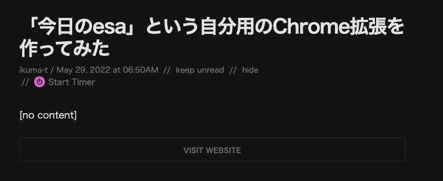

このブログにRSS機能を実装したので、メモを残しておきます。

## RSSについて

### RSSの概要

具体的な実装の前にRSSそのもの仕組みを確認していきます。

- RSSとは、"Rich Site Summary"の略で、サイトの概要を記述する為のXML形式の文書のこと
- 提供されたRSSのことをRSSフィードという

### RSSの拡張子

- 以下の2種類がある
    - RDF：[Resource Description Framework](https://ja.wikipedia.org/wiki/Resource_Description_Framework)
    - XML

### RSSの歴史

1. RSS 0.9：NexScape社が自社のポータルサイトで使用したのが始まり。元々はRDFを使用していたので、「RDF site summary」と呼ばれていた
1. RSS 0.91：XMLで記述される。より多くの情報が配信できるようになったため、「rich site summary」と呼ばれるようになる
1. RSS 1.0：NetScape社がRSS開発から撤退したことにより、「RSS-DEV Working Group」と「Dave WinnerとUserLand Software社」の二派に分かれる。1.0は前者により実装されたもので、RDFで実装されている
1. RSS 2.0：RSS1.0の実装方針（拡張子、名前空間の複雑化）は一部層から不満があるものであったため、UserLand Software社はRSS 0.91からの派生（≠RSS 1.0の後継）としてRSS 0.92~0.94をXMLで実装した。2003年にDave Winnerが移籍したことにより、この流れを汲むRSS 2.0系はハーバード大学へ移管された。

### Atom

- Atomも配信形式の一つである　
- RSSは上記のような論争があるため、しがらみのないところで始めたいという動悸もあってAtomが生まれた。
- [RFC 4287 \- The Atom Syndication Format](https://datatracker.ietf.org/doc/html/rfc4287)

### 参考

- [RSS \- Wikipedia](https://ja.wikipedia.org/wiki/RSS)
- [Resource Description Framework \- Wikipedia](https://ja.wikipedia.org/wiki/Resource_Description_Framework)

## RSS機能の実装

このブログはSSGを利用しているため、`getStaticProps`の中でfeedを作成するように追加します。 実際に行った変更は以下の部分です。

https://github.com/IkumaTadokoro/blog/pull/1/files

タスクとしてはこんな感じです。

- RSSフィードを生成する処理を作成する（`generateRssFeed`）
  - [feed \- npm](https://www.npmjs.com/package/feed)を導入する
  - FeedクラスをnewしてRSSフィードの基本設定をする
  - `Feed#addItem`で記事のRSSフィードを登録する
  - `public/rss`配下に各仕様ごとのRSSフィードを出力する
- `getStaticProps`の中で`generateRssFeed`を呼び出す

RSS自体の仕様がよく分からなくてとりあえずで作ってみたら、リーダーの中でコンテンツが表示されず、[RSS 2\.0 Specification 日本語訳 \- futomi's CGI Cafe](https://www.futomi.com/lecture/japanese/rss20.html)を参考にして値を設定し直しました。

そのため、Feedlyに一度コンテンツがないRSSフィードが載っかってしまったのですが、どうもFeedlyは一度載っかったフィードはFeedly側でキャッシュされてしまうらしく、今もFeedly上の最初の数本の記事のコンテンツはなくなったままです...。
どこか別のところで試せばよかった...。
