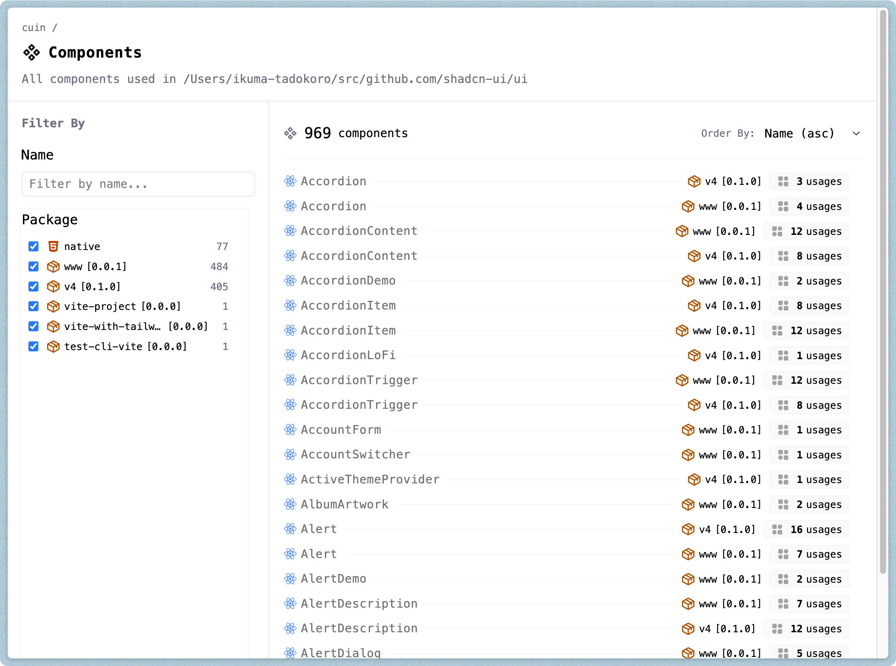
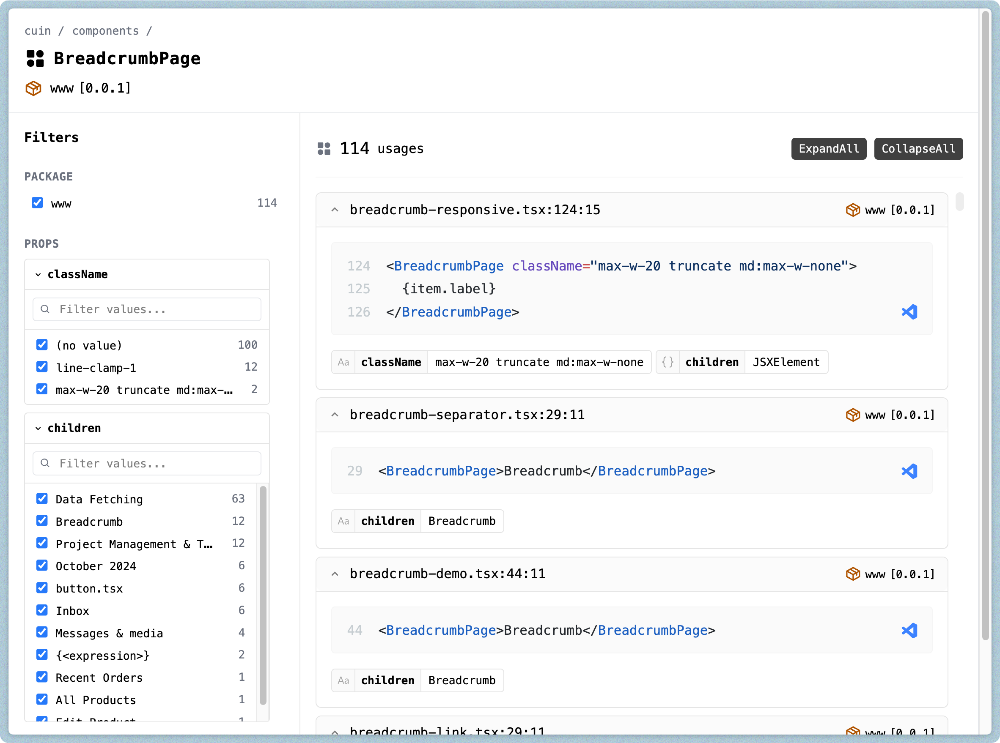
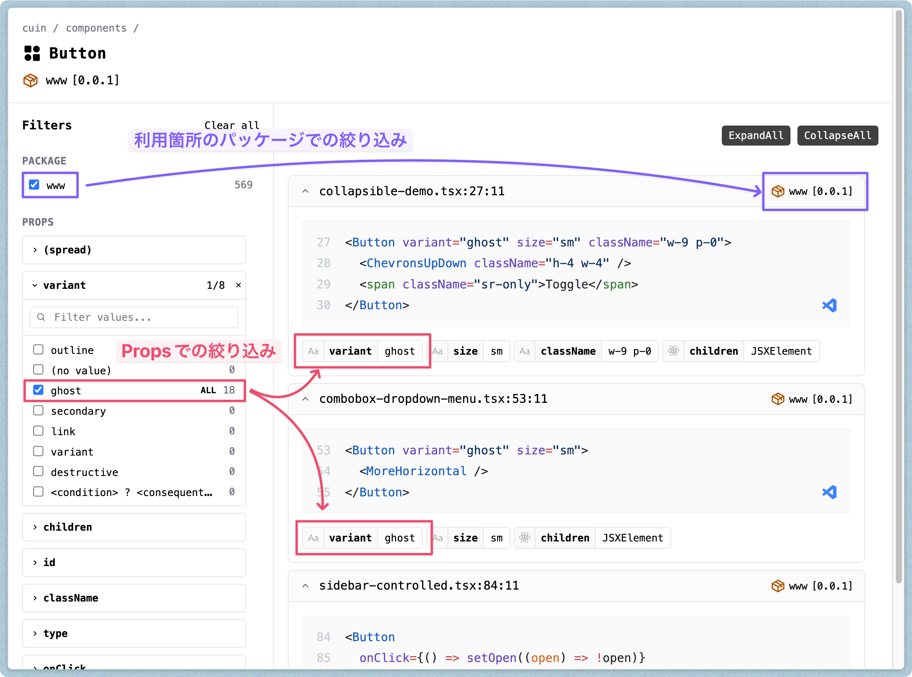
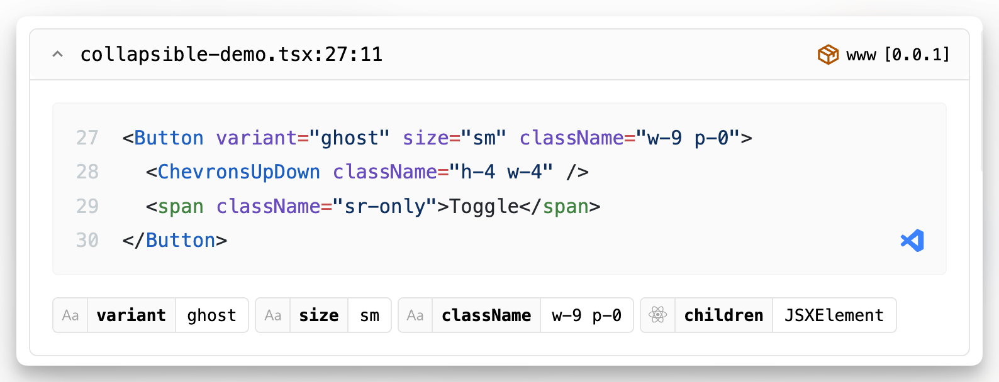

この記事は [株式会社エス・エム・エスAdvent Calendar2025](https://qiita.com/advent-calendar/2025/bm-sms) 12月15日の記事です。

---

横断でのコンポーネント改修作業を効率化するために、コンポーネントの利用状況分析ツール「[cuin](https://www.npmjs.com/package/@ikuma-t/cuin)」を個人で開発しています [^1]。

[^1]: ツール開発の背景については、[スライド - Speakerdeck](https://speakerdeck.com/ikumatadokoro/querying-design-system-dezainsisutemunoyi-si-jue-ding-wozhi-erugou-zao-jian-suo) にあるのでそちらを参照してください。

このツールは引数として受け取ったディレクトリを対象として、コンポーネントの利用状況の分析を行うことができます。

```bash
# カレントディレクトリを対象
npx @ikuma-t/cuin

# パス指定
npx @ikuma-t/cuin -p /path/to/directory
```

分析結果として、次の 2 つのコレクションをいくつかの検索条件を用いながら閲覧することができます。

**1. コンポーネント一覧**



**2. 特定のコンポーネントの利用箇所一覧（以下、詳細ページ）**



---

今回はこのツールの開発において、ページ内検索を利用するために仮想スクロールを使わずに大きめのリストを表示するために行った試行錯誤をお伝えします。

## ページ内検索利用の経緯

### 静的解析の限界からテキスト検索の実装を検討

詳細ページのファセットナビゲーションとして、「コンポーネントの利用箇所のパッケージ」と「使用されている Props とその値の分布」は必須と考え実装していました。



これらに加えて検討していたのが、フリーテキストによる検索です。テキスト検索を検討した背景として、コンポーネントの静的解析の限界があります。AST によるコンポーネント解析はその性質上、動的に決まる値を完全に解析することはできません。

たとえば次のコードにおいて、`value`は文字列であることはわかりますが、その値は解析時に決定するものではありません。また`onChange`には`handleInput`が渡されていることがわかりますが、その定義は別の hooks からきています。

```tsx
import { useState } from 'react';
import { useInput } from './useInput'

function MyComponent() {
  const [value, setValue] = useState('');
  const { handleInput } = useInput();

  return (
    <input type="text" value={value} onChange={handleInput} />
  );
}
```

もちろん最終的な値が静的なものである場合は、定義元を多段で解析をしていくことで値を取得できますが、実行コストがかかるのでこのツールでは対応していません。

解析を緩めにすることで絞り込みできないケースへの補助的な手段として、テキストによるコンポーネント利用状況の検索を検討していました。

### 自前実装を見送った理由

検討をしてみたはいいものの、Props や Package のような絞り込み方法が明白なプロパティと異なり、テキスト検索は精度・結果の表示それぞれに自由度があり、どう実装するかが非常に悩みどころでした。

- 完全一致で検索させるのか、曖昧検索をするのか
- ソースコードの改行を考慮して検索をするのか
- 検索結果はハイライトするのか

加えてドッグフーディングをしてみても、そもそもテキストで検索したいケースが常ではなかった（いつもなくてもいいけど、たまに心が検索したがる程度）ため、どう配置しても「かえって邪魔になる」という始末。

そのため今回はテキスト検索の機能としては実装せず、検索したくなった時にはブラウザのページ内検索を活用する方針としました。

## 仮想スクロールではページ内検索ができない

ページ内検索自体は普通にブラウザを使っていれば使える機能ですが、このツールでは当初仮想スクロールを採用しており、ページ内検索を利用することができませんでした。

仮想スクロールは表示されていない範囲の DOM を描画しないため、ビューポートに現れない要素についてはページ内検索の対象になりません。

仮想スクロールを利用していたのは、いずれのコレクションも少なくとも 1,000 件以上の表示 (詳細ページは 5,000 件) を想定していたことや、詳細ページは特に1要素ごとの情報も多いためです。

ページ内検索を利用できるようにするために何の工夫もなしに仮想スクロールをやめてみたところ、初期描画は辛うじて出来ても、以降のフィルタリングやソートで画面がフリーズしてしまったことから、いくつか調整を行う必要がありました。

## 仮想スクロールを使わずに描画するための調整

ここからは仮想スクロールを使わずにリストを表示するために行なった試行錯誤を紹介します。

### 前提

実装の制約として、以下の理由でReact Server Component や Astro といった (ランタイムかビルド時に関わらず)サーバを要求するアーキテクチャは使えないことを前置きしておきます。

- npm として配布する関係上、UI 部分を事前にビルドしておきたいため
- 将来的に GitHub Pages などの静的ホスティングを行いたい場合に、サーバランタイムが足かせになるため

---

また以降で述べる話については、全体的にパフォーマンスの根拠となる検証値がないのですが、悪しからず...。

### React から SolidJS への切り替え

いきなりだいぶ荒療治ですが、React で書かれていたコンポーネントを [SolidJS](https://www.solidjs.com/) に置き換えました。

もちろん React のまま `useMemo` や `useDeferredValue` を利用して適切なレンダリング・体験に調整していく方法もありますが、画面数も多くなかったことと、クライアントサイドフィルタリングが重いことから、いっそのこと仮想 DOM を使わないのが近道なのでは？と思い、バッサリ切り替えました。

なお仮想 DOM を使わないフレームワークの選択としては Svelte、 Vue Vapor Mode、SolidJS、（部分的に）Qwik などがありますが、もともと JSX で書いていたことからそれを維持できる SolidJS を採択しています。

この時点で一覧ページでのフィルタリング、詳細ページも 500 件くらいであればフリーズせずに動作するようになりました。

### details 要素を利用する

SolidJS への切り替えだけでは詳細ページの想定件数に届いていないのでもう少し調整が必要です。



仕様としてコンポーネントの各要素はいわゆるアコーディオン UI としています。初期実装では特に深く考えず UI ライブラリ（Ark UI）の Accordion を利用していましたが、これを HTML の `details` 要素に置き換えました。

<baseline-status featureId="details"></baseline-status>

`details` 要素に置き換えるメリットは次の 2 つです。

1. アコーディオン自体を表現するための JavaScript が不要になる
2. （Safari を除くブラウザで [^2]）`details` が閉じていても、内部をページ内検索できる [^3]

[^2]: 2025/12 月時点の実装状況による。Chrome、Edge、Firefoxの各Stable版、Safari（Technology Preview）で実装済。refs: https://wpt.fyi/results/html?label=master&label=stable&aligned&view=interop&q=label:interop-2025-details
[^3]: 2 についてはライブラリによっては対応しているものがあるかもしれませんが、もともと使っていた [Accordion | Ark UI](https://ark-ui.com/docs/components/accordion) ではページ内検索の対象とならないようでした。

---

`details` 要素自体は `open` 属性を指定することで開閉状態を切り替えることができます。今回の実装では表示する要素が 300 件を超えた場合、`open=false` で `details` 要素を閉じた状態で初期表示するようにしました。

false になっている要素は DOM として存在しますが、描画処理自体は行われないため、初期描画時の負荷を削減できます。

### details の開閉をバッチ処理にする

`details` 要素が閉じることで初期描画は軽くできますが、実際に閲覧する際に1つ1つ `details` 要素を開いていくことはストレスなので、合わせて全開閉用のボタンも配置しています。

開閉自体は先述の通り `open` を変更したい状態に合わせて書き換える（開くのであれば `open=true`）だけなのですが、これも純粋にループで行うと開閉処理中は画面が固まってしまいます。

そのためいくらかの件数ごとにバッチ処理にした上で、Viewport の中央から放射線状に開閉が行われていく実装としました。単純なバッチ処理としていないのは、上から順にバッチで開閉していくと、リスト下部にいた際にボタンを押したタイミングと開閉が行われるタイミングがズレるためです。


```ts
const DEFAULT_BATCH_SIZE = 100;

// 全details要素の取得（実態はSet）
const items = Array.from(getItems());

// ビューポートの中央の要素を取得
const centerIndex = findCenterElement(items);
// 要素の中央から順にインデックスを配置
const indices = centerOutIndices(items.length, centerIndex);
// バッチサイズごとに分割して処理を実施する
const batches = batchIterate(indices, DEFAULT_BATCH_SIZE);

await new Promise<void>((resolve) => {
  const processBatch = () => {
    const { value: batch, done } = batches.next();

    if (done) {
      resolve();
      return;
    }

    for (const idx of batch) {
      // callbackでdetailsのトグルを開閉
      callback(items[idx]);
    }

    requestAnimationFrame(processBatch);
  };

  requestAnimationFrame(processBatch);
});
```

<details>

<summary>省略した関数部分</summary>

```ts
const findCenterElement = <E extends HTMLElement>(
  items: E[]
): number => {
  const target = window.innerHeight / 2;
  let low = 0;
  let high = items.length - 1;

  while (low < high) {
    // biome-ignore lint/suspicious/noBitwiseOperators: perf
    const mid = (low + high) >>> 1;
    const rect = items[mid].getBoundingClientRect();
    const pos = rect.top + rect.height / 2;

    if (pos < target) {
      low = mid + 1;
    } else {
      high = mid;
    }
  }

  const candidates = [low - 1, low, low + 1].filter(
    (i) => i >= 0 && i < items.length
  );

  let closestIndex = candidates[0];
  let closestDistance = Number.POSITIVE_INFINITY;

  for (const i of candidates) {
    const rect = items[i].getBoundingClientRect();
    const pos = rect.top + rect.height / 2;
    const distance = Math.abs(pos - target);
    if (distance < closestDistance) {
      closestDistance = distance;
      closestIndex = i;
    }
  }

  return closestIndex;
};

function* centerOutIndices(
  totalCount: number,
  centerIndex: number
): Generator<number> {
  if (totalCount === 0) {
    return;
  }

  const center = clamp(centerIndex, 0, totalCount - 1);
  let upper = center;
  let lower = center + 1;

  while (upper >= 0 || lower < totalCount) {
    if (upper >= 0) {
      yield upper;
      upper -= 1;
    }
    if (lower < totalCount) {
      yield lower;
      lower += 1;
    }
  }
}

export function* batchIterate<T>(
  items: Iterable<T>,
  batchSize: number
): Generator<T[]> {
  let batch: T[] = [];

  for (const item of items) {
    batch.push(item);
    if (batch.length >= batchSize) {
      yield batch;
      batch = [];
    }
  }

  if (batch.length > 0) {
    yield batch;
  }
}
```

</details>

開閉ではないですが、イメージとしては以下の動画のように中央から徐々に処理を適用します。

<video controls width="100%">
  <source src="/videos/in-page-search-without-virtual-scroll/animation.mp4" type="video/mp4" />
</video>

これを実際にツールに適用したものが次の動画です。

<video controls width="100%">
  <source src="/videos/in-page-search-without-virtual-scroll/open-details-batch.mp4" type="video/mp4" />
</video>

リスト全体の中央付近で「ExpandAll」をクリックした際に、detailsを開く作業は3秒程度かかっている（右上のExpandAllがdisabledになっている）のですが、ビューポートで見えている範囲については開く作業が瞬時に終わっています。

### content-visibility を利用して要素の描画をやめる

`details` 要素で描画するようにして、大量件数の場合に初期描画で閉じるようにしても、各要素をすべて開いた場合には描画は重くなります。その対策として各 `details` 要素には `content-visibility: auto` を付与しています。

<script type="module" src="https://cdn.jsdelivr.net/npm/baseline-status@1/baseline-status.min.js"></script>

<baseline-status featureId="content-visibility"></baseline-status>

`content-visibility` は要素がビューポートに近づくまで要素のレンダリングを遅らせることができる CSS プロパティです。CSS 版仮想スクロールみたいなものですが、JavaScript での仮想スクロールと異なり、要素自体は DOM に存在するためページ内検索の対象になります。

このプロパティを`details`のコンテンツ部分に適用し、リスト下部の不要な要素のレンダリングを抑制しました。

### Shiki のハイライトを遅延させる

各 `details` の要素は利用箇所のコードブロックを持っており、これは [Shiki](https://shiki.matsu.io/) によってシンタックスハイライトされています（本当はシンタックスハイライトのような処理は事前ビルド or サーバサイドでやれると良いのですが、前提の通りクライアントサイドでハイライトをする必要があります）。

シンタックスハイライトは `details` に含まれる要素の中では比較的重い JavaScript 処理なので、要素が実際にビューポートに入るまでは処理を遅延したいです。先ほどの`content-visibility`はあくまでDOMの話なので、JavaScriptに対しては別途制御をかける必要があります。

こういうケースでは `IntersectionObserver` を利用してビューポートに入ったかを監視することが多いと思いますが、今回のように`content-visibility: auto` を活用している前提においては `contentvisibilityautostatechange` イベントを利用することができます[^4]。

[^4]: contentvisibilityautostatechangeのBaselineは`content-visibility`と同じです。

[Element: contentvisibilityautostatechange イベント - Web API | MDN](https://developer.mozilla.org/ja/docs/Web/API/Element/contentvisibilityautostatechange_event)

`contentvisibilityautostatechange`イベントは `content-visibility: auto` が適用された要素のレンダリング状態が変化した時に発火するイベントで、対象の要素のレンダリングがスキップされるかどうかを `skipped` で判定することができます。

MDN のコード例がわかりやすいので拝借します（引用元：[ContentVisibilityAutoStateChangeEvent - Web API | MDN](https://developer.mozilla.org/ja/docs/Web/API/ContentVisibilityAutoStateChangeEvent)）。

```js
const canvasElem = document.querySelector("canvas");

canvasElem.addEventListener("contentvisibilityautostatechange", stateChanged);
canvasElem.style.contentVisibility = "auto";

function stateChanged(event) {
  if (event.skipped) {
    stopCanvasUpdates(canvasElem);
  } else {
    startCanvasUpdates(canvasElem);
  }
}

// キャンバスの更新を始める必要があるときに呼び出されます。
function startCanvasUpdates(canvas) {
  // …
}

// キャンバスの更新を停止する必要がある場合に呼び出されます。
function stopCanvasUpdates(canvas) {
  // …
}
```

`stateChanged` 関数で使われている `skipped` がこのイベント固有のプロパティで、レンダリングされる場合（=ビューポートに `content-visibility: auto` の要素が近づいた場合）は `false`(=レンダリングする) になります。

---

同様の仕組みを適用することで、前述の仕組みと合わせて、`details` 要素が開いた状態でビューポートに近づくまでシンタックスハイライトを行わないようにすることできます。

```tsx
// ※ コードはイメージです
const handleStateChange = (e: ContentVisibilityAutoStateChangeEvent) => {
  if (!e.skipped) {
    syntaxHighlight();
  }
};

<details>
	<summary>
		<ChevronDownIcon />
		<div>{props.summary}</div>
	</summary>
	<div onContentVisibilityAutoStateChange={handleStateChange} style={{
	  "content-visibility": "auto";
    "contain-intrinsic-size": "auto 200px";
	}}>
		{props.children}
	</div>
</details>
```

## デモ

<video controls width="100%">
  <source src="/videos/in-page-search-without-virtual-scroll/demo.mp4" type="video/mp4" />
</video>

約5,000件の利用箇所をもつコンポーネント（というか`div`ですが）を対象に操作をしてみました。ページ内検索は検索してからブラウザ側のフィードバックが返ってくるまでに少し時間がかかりますが、仮想スクロールなしでページが固まることもなく、ページ内検索も利用できました。

## おわりに

今回はページ内検索を活かすために、仮想スクロールを使わずにそれなりの要素を描画するための試行錯誤を紹介しました。

今回採択している方針や検証の基準は、利用ユーザーが開発者であるという前提のもとに、「NEWLY AVAILABLE であっても問題なし」「（開発者である自分の PC で）ある程度軽快に動けばよし」という判断をしているものなので、すべてのケースでそのまま利用できるわけではありませんが、仮想スクロールを使いたくないケースでの実装の参考になればと思います。

---

以上、[株式会社エス・エム・エスAdvent Calendar2025](https://qiita.com/advent-calendar/2025/bm-sms) 12月15日の記事でした！明日は[@Schumi543](https://x.com/Schumi543)さんです！
