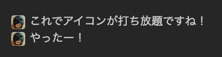

esaやscrapboxでは自分のアバターアイコンを文中にサッと入れられますが、これをObsidianでもやる方法です。



手順はシンプルで、テンプレートとして画像を挿入するホットキーを作ります。

1. 自分のアイコン画像を適当なフォルダに配置する（CSSで調整しますが、20px x 20pxくらいの正方形で用意）

2. テンプレートを作成する。

```md
![[me.png|me]]
```

スタイリングのために、Altをつけています。

3. カスタムCSSを配置する

```css
img[alt="me"] {
  width: 20px;
  height: 20px;
  border-radius: 50%;
  vertical-align: middle;
  margin-right: 6px;
  display: inline;
}
```

4. Templater Pluginを利用して、2で作成したテンプレートにホットキーを適用する

