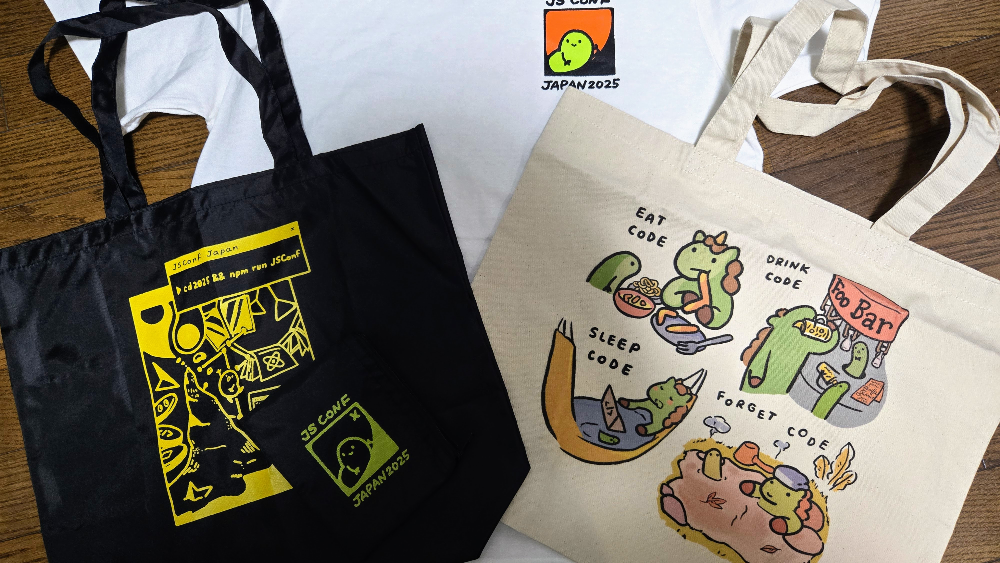
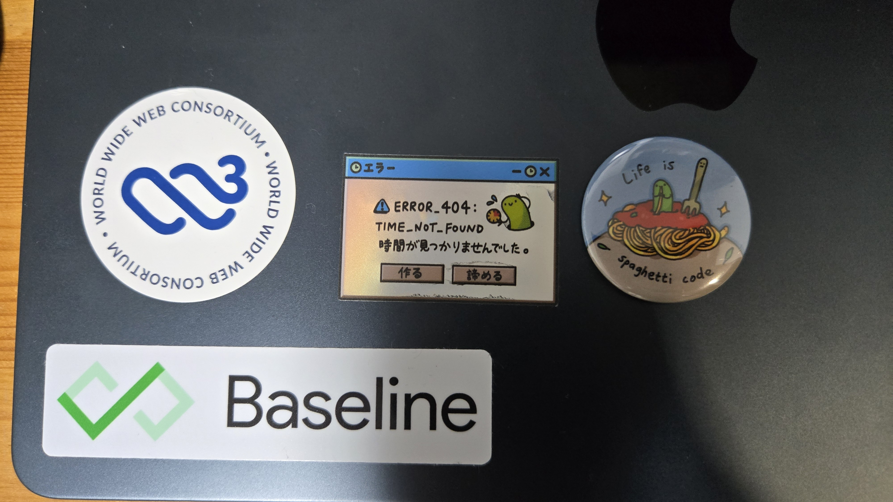

[JSConf JP 2025](https://jsconf.jp/2025/ja) に参加してきました。現地参加は 2 年連続 2 回目です。

## PreEvent

[JSConf.jp 2025 Pre Event - connpass](https://nodejs.connpass.com/event/371397/)

LT の機会をいただけたので、今年は PreEvent@Google 渋谷オフィス にも行きました。

<iframe class="speakerdeck-iframe" frameborder="0" src="https://speakerdeck.com/player/ef07d0e2279348dc99685728d730852b" title="Querying Design System デザインシステムの意思決定を支える構造検索" allowfullscreen="true" style="border: 0px; background: padding-box padding-box rgba(0, 0, 0, 0.1); margin: 0px; padding: 0px; border-radius: 6px; box-shadow: rgba(0, 0, 0, 0.2) 0px 5px 40px; width: 100%; height: auto; aspect-ratio: 560 / 315;" data-ratio="1.7777777777777777"></iframe>

今年からデザインシステム関連の活動も少しずつやり始めていて、その中でコンポーネントの利用状況にアクセスできたら便利なのに（そしてそんなのはエンジニアリングの得意なところだろうに）と思って調べたり、自分で作っていたもの [^1] を発表しました。

すでにツールがあることを知らなかったのは事実なんですが、実際 SaaS である Omlet を使わないとなると、react-scanner に何かしらの View を作りたくなると思うので、そのイメージにつながるといいなと思っています。

[^1]: だいぶ荒い実装ですが、一応公開しています。 https://www.npmjs.com/package/@ikuma-t/cuin

発表中でも触れましたが、今回の内容に近いところを GitHub の人も言っているので、気になる方は見てみてください。

<iframe width="560" height="315" src="https://www.youtube.com/embed/lryIVrpwwWw?si=fGeJQy743xAoxDTV" title="YouTube video player" frameborder="0" allow="accelerometer; autoplay; clipboard-write; encrypted-media; gyroscope; picture-in-picture; web-share" referrerpolicy="strict-origin-when-cross-origin" allowfullscreen></iframe>

---

ここから本編

---

## グッズ購入

地味に楽しみにしていたグッズ購入。

昨年は「接続安定 200」と書かれたのお守りを購入したんですが、今年はトートバッグとステッカーと缶バッジを購入。来場者がもらえる シャツとトートバッグも可愛くて使いやすそう。

いままで PC にステッカーを貼るタイプの人間ではなかったのですが、PreEvent 会場の Google さんから Baseline、サイボウズさんのスポンサーブースで W3C の新ロゴステッカーを入手できたこともあり、バグちゃんのステッカーと一緒に貼ることにしました。

前日の PreEvent で作者の [shelly](https://x.com/shellyy_jelly?lang=ja) さんにもお話できてよかった。来年のグッズも楽しみです。

## ブース

多分全ブース回ったはず。サイボウズさんのブースで FE 横断の改善活動について聞けたのが面白かったです（「俺たちがコンテンツだ」は強い）。

あとブース横のコーヒースタンドの従量課金コーヒー美味しかったです。

## セッション

聞いたセッション。

- [縦書きWebの実用を支えるJavaScript | JSConf JP 2025](https://jsconf.jp/2025/en/talks/vertical-text-web-javascript)
- [Proposal-CompositesによるObject比較の未来 | JSConf JP 2025](https://jsconf.jp/2025/en/talks/proposal-composites-object-comparison)
- [\`Error.prototype.stack\` の今と未来 | JSConf JP 2025](https://jsconf.jp/2025/en/talks/error-prototype-stack)
- [From Chaos to Harmony: A History of JavaScript（混沌から調和へ ― JavaScriptの歴史） | JSConf JP 2025](https://jsconf.jp/2025/en/talks/by-allen)
- [Andromeda - The Future Of TypeScript | JSConf JP 2025](https://jsconf.jp/2025/en/talks/andromeda-future-of-typescript)
- [Evolving the Node.js module loader | JSConf JP 2025](https://jsconf.jp/2025/en/talks/evolving-nodejs-module-loader)
- [Evolution of the Node.js Inspector | JSConf JP 2025](https://jsconf.jp/2025/en/talks/evolution-nodejs-inspector)
- [JavaScript パーサーに using 対応をする過程で与えたエコシステムへの影響 | JSConf JP 2025](https://jsconf.jp/2025/en/talks/javascript-parser-using-support)
- [Module Harmony | JSConf JP 2025](https://jsconf.jp/2025/en/talks/module-harmony)
- [Technical Discussion with TC39 | JSConf JP 2025](https://jsconf.jp/2025/en/talks/technical-discussion-tc39)
- [Sponsor LT x 12 | JSConf JP 2025](https://jsconf.jp/2025/en/talks/sponsor-lt-session)
- [技術的福祉の受容、および Web 開発との「出会い直し」 | JSConf JP 2025](https://jsconf.jp/2025/en/talks/embracing-technical-welfare-and-rediscovering-web-development)

午後のセッション聞いているうちに「CommonJS...」という感想を持ちました😇

どのセッションも DeepDive していて面白かったのですが、個人的には Technical Discussion with TC39 がすごい良かったですね。今出ている Proposal から話をしているので当たり前といえばそうなんですが、 そこまでのトークで出ていた Composites、Module Harmony、using、ES2015 など全部繋がっていてとても良いセッションでした。

## 懇親会

Nuxt の話、Electron の話、帳票エンジンの話など色々とお話できました。お話しいただいた皆さんありがとうございました。

最近仮想 DOM を使わずに実装したい箇所があって SolidJS を選んでいるケースがあったんですが、Vue の Vapor Mode もあるぞ、という話を懇親会で教えてもらったのでちょっと試そうと思ってます。

## おわりに

今年のセッションもどれも聞いていて刺激になるものばかりでした。JavaScript はやっぱり面白いですね。来年は自分も本セッションで話せるように、仕込んでいこうと思いました。

運営の皆さん、登壇者の皆さん、素敵な機会をありがとうございました。また来年。
