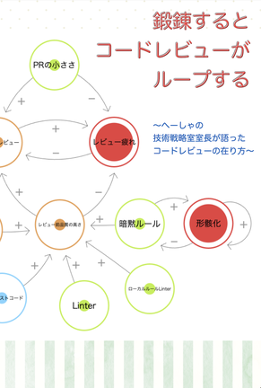
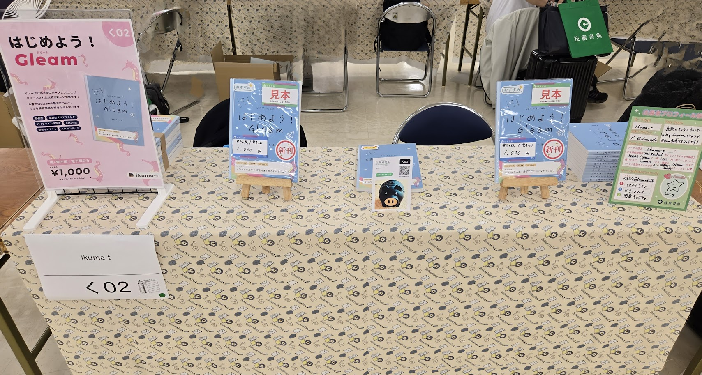

## 技術書典17 オフライン会場に行ってきました！

昨日（2024/11/03）に池袋サンシャインシティで開催された技術書典17のオフライン会場に行ってきました！

オフライン会場は前回の技術書典16で初参加。その際は一般来場者としてでした。2回目となる今回はサークル主として自著を提げて参加しました。

そのため前回ほどゆっくりは会場を回れなかったのですが、色々なサークルの方の書籍を購入できたので、簡単な感想と共に戦利品紹介をしたいと思います。

## 現地会場での戦利品紹介

今回は現物で10冊、在庫が売切で電子で購入させていただいたのが1冊で、現地では計11冊購入させていただきました！

戦利品を書籍の五十音順で簡単に紹介します。

### あざといLT

[あざといLT：LT同好会](https://techbookfest.org/product/uXNrgrx0ZkWdwM54Xv34XR?productVariantID=hbdFKYmiUtjG2C4xFbeQQ8)

X上で面識のある[kaitou](https://twitter.com/Kaitou1192)さんが書かれている、ということもあったのですが、自分自身がときどき外部登壇をしているので参考にしたい！と思い購入しました！

「LT登壇の必勝法は一点突破」というセクションがありまして、中身がぼやけがちな自分には結構刺さりましたね ... ...。聞き手の課題感・レベル感を想像して、それに対して自分の出せる手札から珠玉の一品を出すために、KJ法使ってみようと思います！

ちょうど今月またLTの機会があるので、その際は本書の内容を参考にします！

### アクセシビリティを考えはじめるための本

[アクセシビリティを考えはじめるための本：20 Hour Exception](https://techbookfest.org/product/2KX3LTZs66Y6v8cZZ62mDW?productVariantID=8PkSFLD4Af6j6qYLaqkzNt)

「アクセシビリティの重要さは認識しているし、それを実現するために重要な技術トレンドもとりあえず追いかけてはいるが、自分が向き合っているサービスにその観点を落とし込みきれていない」という課題感を持っていたので、とてもありがたい内容でした。これは普段のお仕事のときにも常に横に置いておく一冊になりそうです。

あとこれは本の内容ではないのですが、行間・字間が適切に取られていて読みやすかったです（後半の章に「知覚しやすい表現を使う」というセクションがあり、「なるほど〜」と一人で納得していました）。

急いで購入していたので、ボイスオーバーによる売り上げの読み上げを存分に味わうことはできなかったのが少し心残りですが、現物を購入できたのでよし！

### Amazon BedrockとGitHub Actionsで文章自動レビューを実装してみる本

[Amazon BedrockとGitHub Actionsで文章自動レビューを実装してみる本：杜の都の開発室](https://techbookfest.org/product/1hA7SzbSbdMMapEmNdbud0?productVariantID=ps5Ls6e501e4GK3VzYtJWq)

ブログ執筆にはtextlintでのチェックを入れているのですが、もう少しチューニングした形でチェックしてもらえたらたしかに嬉しいなあと思い、購入しました。

Amazon BedrockはAWS開催のワークショップに参加して試していたのですが、ちょっとお高いな〜というイメージがありそれ以来使っていませんでした。なので最後の第4章の「トークン数とコストの把握」の内容はありがたかったです。今の記事投稿ペースくらいならBedrockを使ってもいいかも、と思いました！

### 好きなことなら本当に続けられるのか　〜100日連続イラスト投稿してきた日々を振り返る〜 / 鍛錬するとコードレビューがループする　〜へーしゃの技術戦略室室長が語ったコードレビューの在り方〜

みずりゅさんのサークルの書籍を2冊購入させていただきました。

[好きなことなら本当に続けられるのか　〜100日連続イラスト投稿してきた日々を振り返る〜：URAMASU](https://techbookfest.org/product/mQQ6NMBRaLdnr13FT8uZPr?productVariantID=sANGE1ru0cgdpxmLCUfpha)

習慣化の技術、みたいな書籍はときどき読んでいるのですが、なかなか続けられないのが実情（私は日記を途絶え途絶えやっています）。みずりゅさんは100日以上イラスト投稿を続けられていて「すごい！」と心で微笑んでいました。

今回の技術書典参加にあたり自分も人物イラストで表紙を描こうと思ったのですが、まったく納期に間に合う気がしませんでしたので、今回はキャラクターで妥協しました。次回以降の機会に備えて練習しようかなあ。

* * *

[鍛錬するとコードレビューがループする　〜へーしゃの技術戦略室室長が語ったコードレビューの在り方〜：URAMASU](https://techbookfest.org/product/a5iJ9TZAiDFHhH8UCTyJYg?productVariantID=9WicsCgcKcph4GXphjRntj)

もう1冊はコードレビューについての書籍。コードレビューのプラクティスの関係性を図で表現したものです。 個別の要素についての内容を深ぼったものは結構ある印象ですが、こういう全体像の関係性をまとめたものはありそうでなかったので、参考になりました！改善施策を考える上で非常に助かりますね。

* * *

みずりゅさんは過去にGleamに関する書籍を出されていることもあり（Gleamだからかサークル配置が隣）、今回ご挨拶できてよかったです。

### 店舗を読み解く技術～小売業ドメイン知識入門～

[店舗を読み解く技術～小売業ドメイン知識入門～：株式会社プレーンテキスト](https://techbookfest.org/product/3UL8Czdcm8bnSvWXyB2G7C?productVariantID=s3D8XR1JNNfHFKUr64CVR9)

自分は小売業ドメインでは働いていないのですが、実利がなくても業界の知識覚えるのっておもしろいよね！ということで購入。

2章の「店を読む技術」がとくにおもしろく、「そんなところに専門用語ついているんだ」「そういう分類で現場の人は店を見ているのか！」と勉強になりました。ゴンドラエンド、日常でもつかいたいですね。

業界を捉える視点を整理するための書籍、という意味でもとてもよいと感じました。もちろん自分が携わる業界を知るには実際に働く人のところへ行くのが一番だとは思うのですが、エンジニアとしては常にそうしてもいられないし、どうしても座学で把握する必要があります。新しい業界を見る際に、本書の構成は良いガイドラインになりそうだな〜と思っています。

これは余談ですが、本書に出てくる「クルベ」を運営する「ベルク」は私のお気に入りのスーパーです。ベルク大好きエンジニア座談会とかいつか開催されないかなと勝手に思っています、はい。

### 虎の穴ラボの薄い本。vol.8

[虎の穴ラボの薄い本。vol.8：虎の穴ラボ](https://techbookfest.org/product/qVunHzeLL6tr279K8RuEV8?productVariantID=h6LLTMCGwwU6V574j0f2hT)

[東葛.dev](https://hk-it.hatenablog.com/entry/2024/09/17/201653)で知り合った[kouno](https://twitter.com/hk_it7)さんに献本いただき入手しました（協賛ブースは地味に遠かったので、なかなか離れられない1人サークルにはありがたかったです！）。

自分は普段フロントエンドやっているので、Next.jsでのマーケティングツール導入、DenoでのWeb・CLI開発あたりを興味深く読ませていただきました。Cliffyは昔このブログのCLIを作るときに使っていたんですが、結構便利ですよね〜。

あとは随所に散りばめられているキャラの挿絵がとてもかわいくてよかったです ......!最終ページの地方住まいマップもニコニコしながら読ませていただきました🤭

### 「ポッドキャストをやりたい！」 と思ったらまず読む本

[「ポッドキャストをやりたい！」 と思ったらまず読む本：小沢あや](https://techbookfest.org/product/iTx5CrYj0RWzxASzLYHYzy?productVariantID=fD7GfeKfzSFAwnZTJVybD8)

「ポッドキャストをやりたい！」と思っているので、購入させていただきました！ポッドキャスト、なかなか進まず、しかしながら今年中に始めたいと思っていたので、どんぴしゃりな内容でした。

ハウツーの部分ももちろん刺さったのですが、「変にバズらず、狭く、深く、ゆっくり届く」という章が自分にはとても興味深かったです。やさしいせかいだ ... ...。ますますやってみたい意欲が高まりましたね。

頑張って今年中に技術系のLTを軸にしたひとりポッドキャストを始めたいと思ってるので、本書の内容参考にします！

### まじでめちゃくちゃ分かりやすい棒針編み入門漫画＜1巻＞

[まじでめちゃくちゃ分かりやすい棒針編み入門漫画＜1巻＞：オノデラユズカオ制作](https://techbookfest.org/product/wWdEXb0e1b0YwLi4N0Mv17?productVariantID=bXrpUEwbj5NcWvHLNDxSBT)

自分は過去に[刺繍をはじめてみた](/blog/sisyu)こともあるのですが、どうも室内でできる趣味領域を開拓したい傾向があり、その流れで購入しました。

棒針編み、アニメとかで見て憧れますよね〜。できたらいいなと思いつつ、自分はあまり裁縫系（というか立体視？）が得意ではなく、書籍にある図を見ても「どれをどうしたらこうなるんじゃい ... ...」と途方に暮れることもしばしば。一方この本は図も大きくめちゃめちゃわかりやすいので、なんだか自分でもできる気がしました（漫画だけでも読み物として面白かったです）！

やったことは愚か道具すらないのですが、本書を読んで冬休みの予定が決まりましたね。

### Ruby on Rails8入門！

[Ruby on Rails8入門！：def合同会社](https://techbookfest.org/product/41bEtMuRb2xADJH5E0WWVC?productVariantID=2hufyTuCnbtJu8bCHDG6pU)

お隣のお隣のサークル（といいつつ、お隣のブースはお休みだったので、実質お隣）で販売されていた書籍です。こちらのブースにお越しいただいて話していたのですが、実は意外に接点があり盛り上がっておりました。

物理本は売り切れとのことだったので電子版で読ませていただきました。

最近はあまりRubyも書いておらずちゃんと中身まで見ていたのがRails 7系、DHHのポスト等をちらみしてワードだけは追っているが ... ... というレベル感だったので、本書でキャッチアップできてよかったです。

Rails、初学者のときはアプリを作るのは簡単だけど、デプロイが難しい、という印象があって、kamalは結構良さそうに思いました。少し前から開発用のDockerも含めてデフォルトで使えるようになっていましたが、ここらへんどんどん便利になっていきますね〜。

### ゆるIETF

[ゆるIETF：asnokaze](https://techbookfest.org/product/aA3CXwXHh9Z3bG4b7B3D8q?productVariantID=TLPGS2DTAnvQEd2FcrGzL)

今回のオフライン会場で絶対に入手したい一冊でした。[ASnoKaze blog](https://asnokaze.hatenablog.com/entry/2024/11/02/100659)は内容わかるときもわからない時もあるのですが、毎回読ませて勉強させていただいています。

HTTP/3のマスコットキャラの話や言語缶バッジの話など、おもわずふふッとなるお話しが多く、IETFという一般的な印象では固いテーマながら非常に楽しく読ませていただきました。標準化って難しいイメージあるけど、そこにはやっぱり人がいるんだなあという感想です。

最後の章では最新技術の動向を追う方法についても記載があり、自分はあまりここら辺を実践できていないので、今後の参考にさせていただこうと思います。

## サークル参加

... ... と、ここまで購入してきた書籍は基本的に15分くらいの休憩時間でシュバっと購入して、あとは自身のサークルの販売をやっていました。

まだマイナーな言語なので、正直数冊売れてくれれば十分だと思っていたのですが、思いの外多くの方にご購入いただけて嬉しかったです！

オンラインマーケットではまだ電子版および電子+紙版が購入できるので、ぜひチェックしていただければと思います！

[はじめよう！Gleam：ikuma-t - 技術書典オンラインマーケット](https://techbookfest.org/product/fULZb6u3f2Lq84BkTCU0hC?productVariantID=4fdAqQ0V0RLFRwYFUnaUHb)